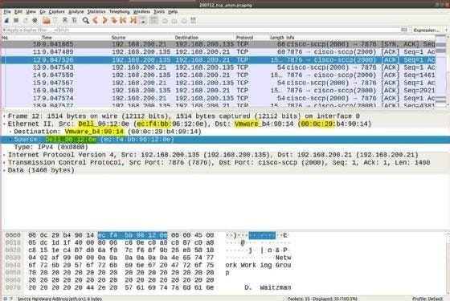
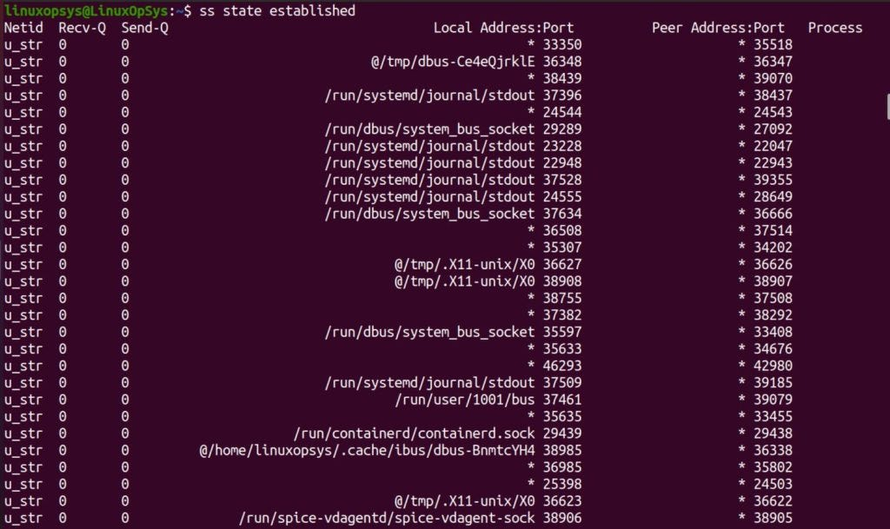

# OS CPU, Memory & Disk Usage

## Check Disk Usage
```
df -h
# exclude memory-based filesystems like tmpfs
df -lh --total -x tmpfs
# display in gigabytes
df -BG

### disk usage at directory/file level
sudo du -a /var/lib | sort -n -r | head -n 20

# interactive disk usage view
sudo ncdu /var

# check if deleted open files consuming space
sudo lsof | grep deleted

```

## Viewing Running Processes

```
# get currently running processes
ps -ef
ps aux

# get top 10 processes sorted by memory consumption
ps aux --sort=-%mem | head -n 10

# get top 10 processes sorted by cpu consumption
ps -eo pid,ppid,user,%cpu,%mem,cmd --sort=-%cpu
ps aux --sort=-%cpu | head -n 10

# find postgres related processes
ps -fp $(pgrep -d, -f postgres)

# interactively check processes
top
htop

```

## Checking System Uptime
```
uptime
uptime -p

uptime -p | awk '{print "Uptime:", $2, $3, $4, $5}'
ssh user@remote_host “uptime”

```

## Viewing System Logs

```
# display kernel messages and boot information
sudo dmesg

# get systemd logs which collects kernel, services, and application logs
journalctl
journalctl -u postgres
journalctl | grep postgres | head -n 20

# get logs from current boot
journalctl -b

# get newest entries first
journalctl -b -r

# filter logs for a time duration
journalctl --since “2025-02-20 08:00:00” --until “2025-02-20 10:00:00”
```

## Checking Memory Usage

```
# get memory usage
free -h
free -m

# inspect memory usage per process
ps -eo pid,user,%mem,%cpu,comm --sort=-%mem | head -n 10

# prints system uptime followed by memory statistics in a human-friendly format.
uptime; free -h

# monitor memory usage in real time
watch -n 1 free -h
```

## vim /tmp/ps_aggregate.sh; chmod +x /tmp/ps_aggregate.sh
```
#!/bin/bash

# Define a function to determine the sort keys based on the column name
get_sort_key() {
    local col_name="$1"
    case "$col_name" in
        TOTAL_%MEM) echo "-k2 -rn" ;;
        AVG_%MEM) echo "-k3 -rn" ;;
        TOTAL_%CPU) echo "-k4 -rn" ;;
        AVG_%CPU) echo "-k5 -rn" ;;
        INSTANCES) echo "-k6 -rn" ;;
        COMMAND) echo "-k1 -r" ;; # Sort by command name, reverse alphabetical
        *) echo "" ;; # Default to no sort if invalid name is provided
    esac
}

# --- Determine Sort Arguments ---

# Check if arguments were passed
if [ $# -eq 0 ]; then
    # Default sort if no arguments are provided
    SORT_COLS=('TOTAL_%CPU' 'TOTAL_%MEM')
else
    # Use provided arguments
    SORT_COLS=("$@")
fi

# Build the complete sort command arguments
SORT_ARGS=""
for col in "${SORT_COLS[@]}"; do
    key=$(get_sort_key "$col")
    if [ -n "$key" ]; then
        SORT_ARGS="$SORT_ARGS $key"
    fi
done

# --- Main Script Logic ---

ps -eo user,%mem,%cpu,comm --no-headers --sort=-%mem | \
awk '{
    # Aggregate CPU, MEM, and Count by Command (first part of the comm path)
    split($4, parts, "/")
    cmd = parts[1]
    mem[cmd] += $2
    cpu[cmd] += $3
    count[cmd]++
}
END {
    # Print data in pipe-separated format:
    # COMMAND|TOTAL_%MEM|AVG_%MEM|TOTAL_%CPU|AVG_%CPU|INSTANCES
    for (cmd in mem) {
        printf "%s|%.2f|%.2f|%.2f|%.2f|%d\n", 
               cmd, mem[cmd], mem[cmd]/count[cmd], cpu[cmd], cpu[cmd]/count[cmd], count[cmd]
    }
}' | sort -t'|' ${SORT_ARGS} | \
awk 'BEGIN {
    # Print headers
    printf "%-30s %12s %10s %12s %10s %10s\n", "COMMAND", "TOTAL_%MEM", "AVG_%MEM", "TOTAL_%CPU", "AVG_%CPU", "INSTANCES"
    printf "%-30s %12s %10s %12s %10s %10s\n", "-------", "----------", "--------", "----------", "--------", "---------"
    FS="|"
}
{
    # Print formatted output
    printf "%-30s %12.2f %10.2f %12.2f %10.2f %10d\n", $1, $2, $3, $4, $5, $6
}'
```

### Usage

```
/tmp/ps_aggregate.sh | head -n 11
watch -n 2 bash /tmp/ps_aggregate.sh
./ps_aggregate.sh	Sorts by default: TOTAL_%CPU (descending), then TOTAL_%MEM (descending).
./ps_aggregate.sh 'TOTAL_%MEM'	Sorts by TOTAL_%MEM (descending).
./ps_aggregate.sh 'INSTANCES' 'TOTAL_%CPU'	Sorts by INSTANCES (descending), then TOTAL_%CPU (descending).
./ps_aggregate.sh 'COMMAND' 'AVG_%MEM'	Sorts by COMMAND (reverse alphabetical), then AVG_%MEM (descending).
```


# [Basic Networking in Linux](https://github.com/sre-infra-labs/Linux-Learning/blob/main/Fresh-Linux-OS-Setup/Sofwares-n-Config.md#configure-static-ipv4-for-inet1-adapter)

## The Hosts File - maps human readable names to ip

`cat /etc/hosts`

## [Resolve.conf file](https://linuxopsys.substack.com/i/175435099/resolveconf-file)

The /etc/resolv.conf file tells your system where to look up domain names (like google.com) when they’re not found in /etc/hosts. It lists the IP addresses of DNS servers, which are responsible for translating domain names into IP addresses.

```
# On RedHat systems

    [root@pg-cls2-prod1 ansible]# cat /etc/resolv.conf
    # Generated by NetworkManager
    nameserver 192.168.1.1
    nameserver 192.168.100.10
    nameserver 8.8.8.8

# On Ubuntu systems

    root@pg-cls1-prod1:/home/ansible# cat /etc/resolv.conf

    nameserver 127.0.0.53
    options edns0 trust-ad
    search .

```

## [Client DHCP Settings](https://linuxopsys.substack.com/i/175435099/client-dhcp-settings)

Most networks use DHCP (Dynamic Host Configuration Protocol) to automatically assign network settings to devices.

`cat /etc/dhcp/dhclient.conf`

## Network Configuration

### NetworkManager in Redhat/Ubuntu

- `NetworkManager` provides tools for managing network connections.
- Use `nmcli` and `nmtui` for command-line and text-based interface management, respectively.

```
# get device status
nmcli d status

# text-based interface
nmtui
```

### Netplan in Ubuntu

- Netplan is used for network configuration in Ubuntu.
- Configuration files are typically found in /etc/netplan/.


## [Display All Interface IPs](https://linuxopsys.substack.com/i/175435099/display-all-interface-ips)

`ip addr show`

- On RedHat based systems, these files are found in /etc/NetworkManager/system-connections/<link>.nmconnection

        [root@pg-cls2-prod1 ansible]# ls -l /etc/NetworkManager/system-connections/
        total 8
        -rw-------. 1 root root 363 May 11 11:18 enp1s0.nmconnection
        -rw-------. 1 root root 229 May 11 10:32 enp2s0.nmconnection

        [root@pg-cls2-prod1 ansible]# **************************************************************
        [root@pg-cls2-prod1 ansible]# cat /etc/NetworkManager/system-connections/enp1s0.nmconnection 
        [connection]
        id=enp1s0
        uuid=3d7529a9-2dbe-3080-8bb3-cc8cb73f1f2d
        type=ethernet
        autoconnect-priority=-999
        interface-name=enp1s0
        timestamp=1746939149

        [ethernet]

        [ipv4]
        address1=192.168.100.48/24,192.168.100.10
        dns=192.168.100.10;8.8.8.8;
        method=manual
        never-default=true
        route1=192.168.200.0/24,192.168.100.10,100

        [ipv6]
        addr-gen-mode=eui64
        method=auto

        [proxy]

        [root@pg-cls2-prod1 ansible]# **************************************************************
        [root@pg-cls2-prod1 ansible]# cat /etc/NetworkManager/system-connections/enp2s0.nmconnection
        [connection]
        id=enp2s0
        uuid=4cee1e8d-06ab-3a60-bc4a-2354c81cd088
        type=ethernet
        autoconnect-priority=-999
        interface-name=enp2s0
        timestamp=1746939160

        [ethernet]

        [ipv4]
        method=auto

        [ipv6]
        addr-gen-mode=eui64
        method=auto

        [proxy]


- On Ubuntu based systems, these files are found in /etc/netplan/

        root@pg-cls1-prod1:/home/ansible# ls -l /etc/netplan/
        total 4
        -rw------- 1 root root 362 May  1 13:35 50-cloud-init.yaml

        root@pg-cls1-prod1:/home/ansible# cat /etc/netplan/50-cloud-init.yaml
        network:
        version: 2
        ethernets:
            enp1s0:
            dhcp4: false
            addresses: [192.168.100.43/24]
            nameservers:
                addresses: [192.168.100.10, 192.168.100.1]
            routes:
                - to: 192.168.0.0/16
                #scope: link
                via: 192.168.100.10
                #- to: 192.168.200.0/24
                #via: 192.168.100.1

            enp7s0:
            dhcp4: true

## [Setting a Static IP](https://github.com/sre-infra-labs/Linux-Learning/blob/main/Fresh-Linux-OS-Setup/Sofwares-n-Config.md#configure-static-ipv4-for-inet1-adapter)

- `ip` command
```
$ sudo ip addr add 192.168.1.100/24 dev eth0
$ sudo ip link set eth0 up
$ sudo ip route add default via 192.168.1.1 dev eth0
```

- `nmcli (Network Manager)` command
```
$ nmcli con mod eth0 ipv4.addresses 192.168.1.100/24
$ nmcli con mod eth0 ipv4.gateway 192.168.1.1
$ nmcli con mod eth0 ipv4.dns 8.8.8.8
$ nmcli con up eth0

```

### Adding a Default Gateway

The default gateway is the IP address of the router that your system uses to access the internet or other networks

```
$ ip route add default via 192.168.1.1

$ ip route show
```

## Verify routing
```
# Default route on RedHat system

        [root@pg-cls2-prod1 ansible]# ip route show
        default via 192.168.1.1 dev enp2s0 proto dhcp src 192.168.1.232 metric 101 
        192.168.1.0/24 dev enp2s0 proto kernel scope link src 192.168.1.232 metric 101 
        192.168.100.0/24 dev enp1s0 proto kernel scope link src 192.168.100.48 metric 100 
        192.168.200.0/24 via 192.168.100.10 dev enp1s0 proto static metric 100 

# Default route on Ubuntu system

        root@pg-cls1-prod1:/home/ansible# ip route show
        default via 192.168.1.1 dev enp7s0 proto dhcp src 192.168.1.152 metric 100 
        192.168.0.0/16 via 192.168.100.10 dev enp1s0 proto static 
        192.168.1.0/24 dev enp7s0 proto kernel scope link src 192.168.1.152 metric 100 
        192.168.1.1 dev enp7s0 proto dhcp scope link src 192.168.1.152 metric 100 
        192.168.100.0/24 dev enp1s0 proto kernel scope link src 192.168.100.43 
```

## Network Service

```
$ systemctl start NetworkManager
$ systemctl stop NetworkManager
```

## Network Troubleshooting

### Verifying Network Port
```
telnet google.com 443
telnet pg-consul-rhel 8500

nc -zv pg-consul-rhel 8500
```

### Verifying Open Ports (Locally)
```
netstat -tulnp | grep 8500
netstat -tulnp | grep 1433
netstat -tulnp | grep 5432

    [root@pg-consul-rhel consul.d]# netstat -tulnp | grep 8500
    tcp6       0      0 :::8500                 :::*                    LISTEN      2765/consul

    (base) ----- [2025-Oct-08 07:18:54] saanvi@ryzen9 (tmp)
    |------------$ sudo netstat -tulnp | grep 1433
    tcp        0      0 0.0.0.0:21433           0.0.0.0:*               LISTEN      13980/nginx: master 
    tcp6       0      0 :::1433                 :::*                    LISTEN      6570/rootlessport   

    |------------$ sudo netstat -tulnp | grep 5432
    tcp        0      0 0.0.0.0:5432            0.0.0.0:*               LISTEN      4660/postgres       
    tcp        0      0 0.0.0.0:25432           0.0.0.0:*               LISTEN      13980/nginx: master 
    tcp6       0      0 :::5432                 :::*                    LISTEN      4660/postgres       

```

### Test Connectivity

`ping google.com`

## Tracing Route

To trace the route packets take to reach a host, use the `traceroute`/`tracepath` command.

```
traceroute pg-consul-rhel

        [root@pg-cls2-dr1 ansible]# traceroute pg-consul-rhel
        traceroute to pg-consul-rhel (192.168.100.41), 30 hops max, 60 byte packets
        1  192.168.200.10 (192.168.200.10)  0.179 ms  0.149 ms  0.128 ms
        2  pg-consul-rhel (192.168.100.41)  0.340 ms !X  0.321 ms !X  0.320 ms !X

tracepath pg-consul-rhel

        [root@pg-cls2-dr1 ansible]# tracepath pg-consul-rhel
        1?: [LOCALHOST]                      pmtu 1500
        1:  192.168.200.10                                        0.179ms 
        1:  192.168.200.10                                        0.105ms 
        2:  pg-consul-rhel                                        0.291ms !H
            Resume: pmtu 1500 
```

## Capturing Network Traffic

```
sudo tcpdump -i enp0s1

# capture DNS traffic on port 53
sudo tcpdump -i any -s0 -A -n port 53
```

## DNS query

dig is the common tool used to obtain DNS records and network troubleshooting. You may also use resolvectl with query option to get the same information.

```
# Simple A record query
$ dig example.com

# Query using a specific DNS server
$ dig @8.8.8.8 example.com

# Query locally for writer postgres host in Cluster
$ dig @127.0.0.1 master.pg-cls2-prod.consul.lab.com

# Query remotely for writer postgres host in Cluster
$ dig @pg-consul-rhel master.pg-cls1-prod.consul.lab.com
$ dig @pg-consul-rhel standby-leader.pg-cls1-dr.consul.lab.com
$ dig @pg-consul-rhel master.pg-cls2-prod.consul.lab.com
$ dig @pg-consul-rhel standby-leader.pg-cls2-dr.consul.lab.com


# Reverse DNS lookup
$ dig -x 8.8.8.8

# Provides a short, concise output, query 127.0.0.53 is typically used for local DNS resolution in systems that use systemd-resolved.
$ dig +short @127.0.0.53 example.com
$ dig @pg-consul-rhel standby-leader.pg-cls1-dr.consul.lab.com +short

# Query a domain
$ resolvectl query example.com

# Monitor changes in DNS and DNSSEC ie the ongoing queries
$ sudo resolvectl monitor

# Inspecting DNS Cache
$ resolvectl show-cache
```

# Network Monitoring Tools

## Wireshark

- Wireshark is a graphical tool for network analysis and troubleshooting.
- It captures and displays packets for detailed examination.



## iftop

To monitor network bandwidth usage, use iftop.

```
sudo iftop -i enp0s1
```

## ss

- The ss command is an advanced tool for examining sockets in Linux, offering faster and more detailed information than the older netstat command.
- When executed without any options, ss lists all open sockets.

```
# Display summary of sockets
ss -s

# List all tcp & udp sockets, both listening and non-listening
ss -tulnp

# get all established connections
ss state established

# get sockets using port 5432
ss -tulnp | grep 5432
```




