# [Proper PostgreSQL Parameters to Prevent Poor Performance | Greg Dostatni | Postgres World Webinars](https://youtu.be/CYJvZJP_lZA?feature=shared)

## Workloads and Data
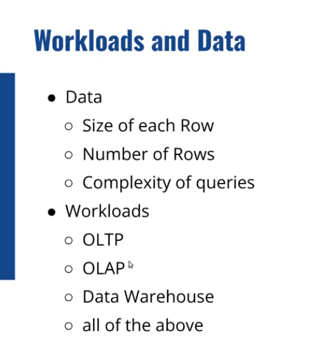

## OLTP vs OLAP?
  - How much data a user query processes?
- OLTP - 20 ms
- Medium analytical query - 20 seconds
- Datawarehouse - 20 hours

## Reading of Data
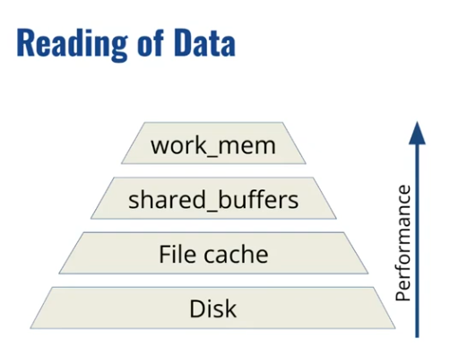

## Writing of Data
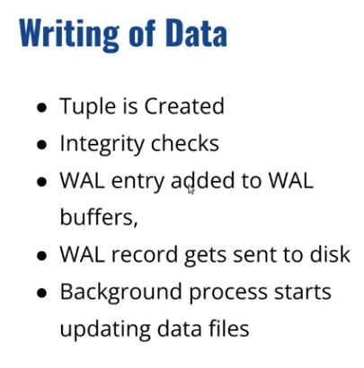

> Keep IO for Writes as Read can be satisfied from Shared Buffers if planned properly

## Parameters
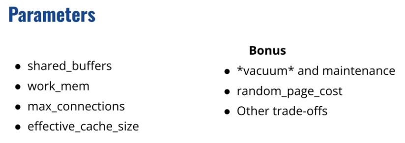

## shared_buffers
- A global memory pool allocated once at PostreSQL startup
- Used for caching table and index pages shared across all sessions

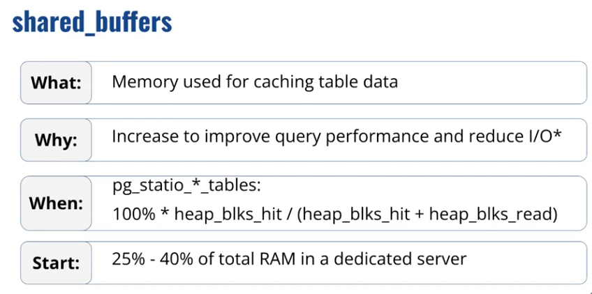

## work_mem
- A per-operation, per-query memory allocation
- Used for sorting, hashing, materialization, not from `shared_buffers`.

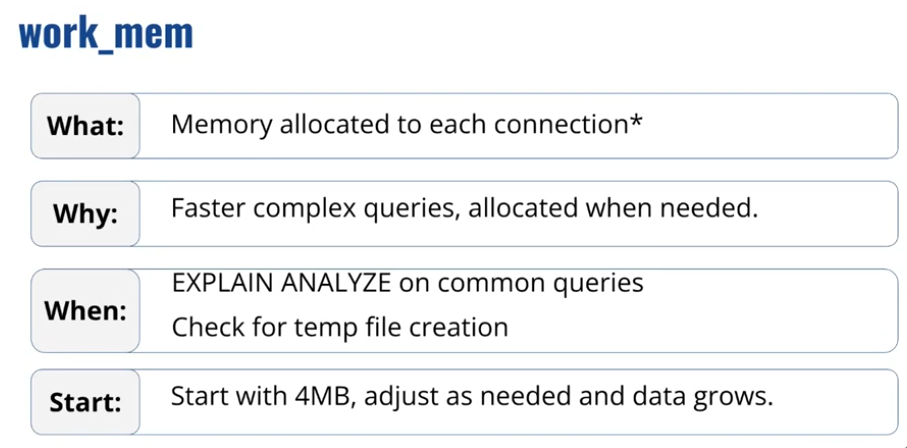

## max_connections
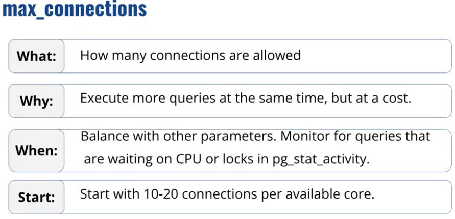

## effective_cache_size

- It is not a memory allocation parameter.
- Instead, it is a query planner hint that tells PostgreSQL how much memory is available for caching data across:
    - PostgreSQL shared_buffers
    - OS file system cache

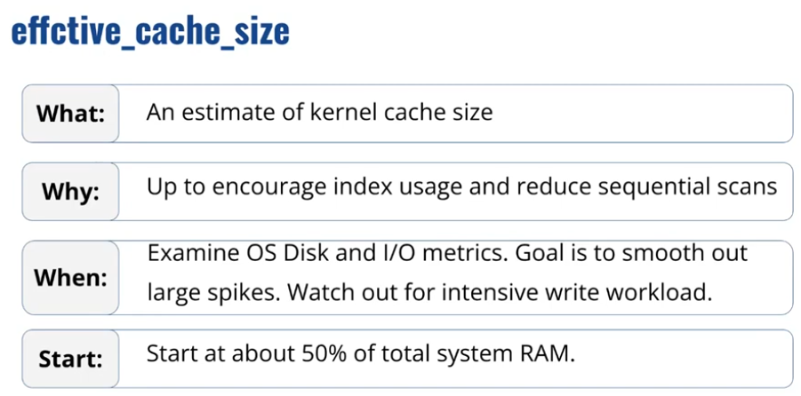

## What If?

### What is OOM Killer (Out of Memory Killer)?
  - > Check point 5 below

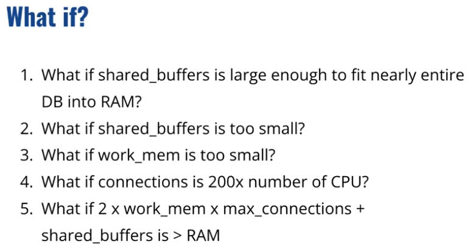

## Vacuum

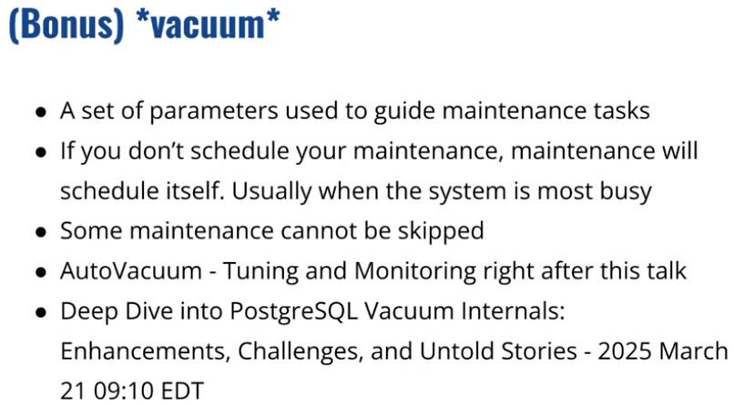

## random_page_cost

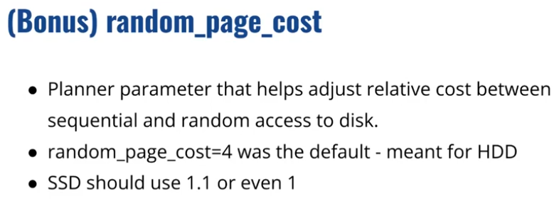

## Indexes

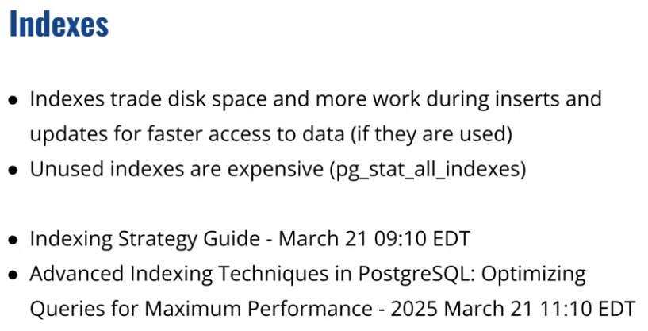

## Connection pooling

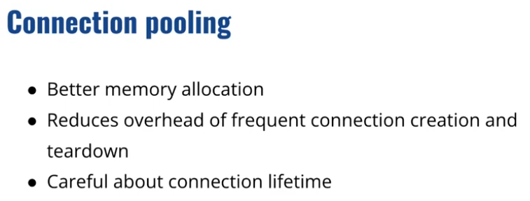

## Caching

> Best work is the work you can avoid!

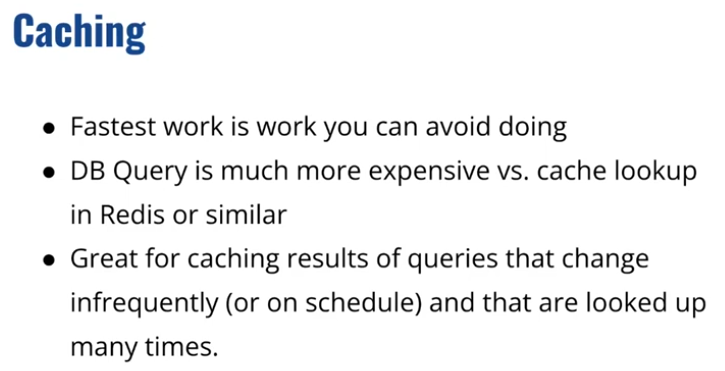

