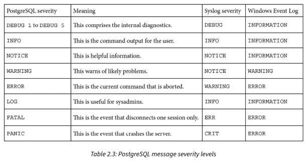

# What version is the server?
- Each major release is support for 5 years.

```
select version();

        PostgreSQL 16.10 (Ubuntu 16.10-1.pgdg24.04+1) on x86_64-pc-linux-gnu, compiled by gcc (Ubuntu 13.3.0-6ubuntu2~24.04) 13.3.0, 64-bit

show server_version;
        16.10 (Ubuntu 16.10-1.pgdg24.04+1)

show server_version_num ;

         server_version_num
        --------------------
        160010


```

# What is server uptime?

```
select  pg_postmaster_start_time(), 
        date_trunc('second', current_timestamp - pg_postmaster_start_time()) as uptime,
        ;

        pg_postmaster_start_time         |  uptime
        ---------------------------------+----------
        2025-09-14 12:19:45.76914+05:30  | 08:37:18

```

# Locating the database server files

- **Debian or Ubuntu** systems: */var/lib/postgresql/MAJOR_RELEASE/main*
- **Red Hat RHEL, CentOS, and Fedora**: */var/lib/pgsql/data/*
- Systems deployed with **Trusted Postgres Architect (TPA)**: */opt/postgres/data*
- **Windows**: C:\Program Files\PostgreSQL\MAJOR_RELEASE\data

**`pg_lsclusters`** utility displays a list of all the available database servers, including information for each server.
- This utility is part of `postgresql-common` package.

```
root@ryzen9:/stale-storage/GitHub/Linux-Learning# pg_lsclusters

        Ver Cluster Port Status Owner    Data directory              Log file
        16  main    5432 online postgres /var/lib/postgresql/16/main log/postgresql-%a.log
```

```
sudo -u postgres psql

show data_directory;

        /var/lib/postgresql/16/main

```

# Locating configuration files

- **Debian or Ubuntu** systems: */etc/postgresql/MAJOR_RELEASE/main*
- **Red Hat RHEL, CentOS, and Fedora**: in $PGDATA directory
- Systems deployed with **Trusted Postgres Architect (TPA)**: in $PGDATA directory
- **Windows**: in $PGDATA directory

# **`pg_createcluster`** utility should be used in place of `initdb` for debian/ubuntu systems
- This helps in selecting correct MAJOR_VERSION while setting database cluster
- This utility is part of `postgresql-common` package.

# Some common directories in $PGDATA directory

- **base** - main table storage. Within this, each database has its own directory and files for each object.
- **global** - Tables that are shared across all databases, including the list of databases.
- **pg_wal** - Transaction log, or Write-Ahead Log (WAL) files
- **pg_tblspc** - Symbolic links to tablespace directories

# Locating the database server's message log

- `log_destination` - controls where log messages are stored. Valid values are `stderr, csvlog, syslog`, & `eventlog` for windows.
- The **logging collection** is a background process that writes to a log file everything that the PostgreSQL server outputs to `stderr`.
- Log rotation can be controlled with settings like `log_rotation_age` and `log_rotation_size` if using logging collector.
- Additionally `logrotate` utility can also be utilized
- `log_min_messages` - Adjust number of messages being logged
- `log_error_verbosity` - Information level being send to log
- `log_line_prefix` - Can be adjusted to identify additional information of logs like user/database etc.
- Other parameters - log_statements, log_checkpoints, log_connections, log_disconnections, log_verbosity, log_lock_waits

```
show log_destination;

        log_destination
        -----------------
        stderr

show log_directory;

        log_directory
        ---------------
        log
-- NOTE: Without full path, the log_directory is always relative to $PGDATA directory.
-- In this case, log directory should be $PGDATA/log
```



# Locating the database's system identifier

- Each database server has a system identifier assigned when the database is initialized (created).
- This server identifier remains the same if the server is backed up, cloned, and so on.
- `pg_controldata` utility can be used to get 

```
# find path of pg_controldata
plocate pg_controldata | grep postgres | grep bin

# find system identifier and other meta data
sudo /usr/lib/postgresql/16/bin/pg_controldata /var/lib/postgresql/16/main

        |------------$ sudo /usr/lib/postgresql/16/bin/pg_controldata /var/lib/postgresql/16/main
        pg_control version number:            1300
        Catalog version number:               202307071
        Database system identifier:           7354714345333928959
        Database cluster state:               in production
        pg_control last modified:             Sun 14 Sep 2025 12:24:45 PM IST
        Latest checkpoint location:           C3/45B667B8
        Time of latest checkpoint:            Sun 14 Sep 2025 12:24:45 PM IST
        wal_level setting:                    replica
        max_connections setting:              100
        max_worker_processes setting:         8
        max_wal_senders setting:              10
        WAL block size:                       8192
        Bytes per WAL segment:                16777216

```

# listing databases on server

- `template1` database is used as template for any new database
- `template0` is used as backup for `template1`
- 0

```
\l+

or

psql -l

or

select * from pg_database;
```

# How much disk space for a table use?

- In PostgreSQL, a table is made up of many relations. The main relation is the data table.
- Each index is a relation
- Long data values are placed in secondary table call **TOAST (The Oversize Attribute Storage Technique)**.
- In most cases, each table has TOAST table and a TOAST index
- There are also files marked below that are part of maintenance
  - `_vm` - Visibility Map
  - `_fsm` - Free Space Map
  - `_init` - These are used for unlogged tables and their indexes

```
\c stackoverflow
\dt+

        Schema |   Name    | Type  |  Owner   | Persistence | Access method |  Size   | Description 
        --------+-----------+-------+----------+-------------+---------------+---------+-------------
        public | badges    | table | postgres | permanent   | heap          | 3263 MB | 
        public | comments  | table | postgres | permanent   | heap          | 20 GB   | 
        public | postlinks | table | postgres | permanent   | heap          | 514 MB  | 
        public | posts     | table | postgres | permanent   | heap          | 58 GB   | 
        public | tags      | table | postgres | permanent   | heap          | 3736 kB | 
        public | users     | table | postgres | permanent   | heap          | 2773 MB | 
        public | votes     | table | postgres | permanent   | heap          | 11 GB   | 


-- get size of table
select pg_size_pretty(pg_relation_size('users'));

-- get size of table and indexes
select pg_size_pretty(pg_total_relation_size('users'));

```

# Which are my biggest tables?

```
SELECT quote_ident(table_schema)||'.'||quote_ident(table_name) as name
,pg_relation_size(quote_ident(table_schema)
|| '.' || quote_ident(table_name)) as size
FROM information_schema.tables
WHERE table_schema NOT IN ('information_schema', 'pg_catalog')
ORDER BY size DESC
LIMIT 10;

                      name              |    size
        --------------------------------+-------------
        public.posts                   | 56281726976
        public.comments                | 21485912064
        public.votes                   | 12330074112
        public.badges                  |  3420454912
        public.users                   |  2824404992
        public.postlinks               |   538968064
        public.tags                    |     3792896
        public.pg_stat_statements_info |           0
        public.pg_stat_statements      |           0

```

# How many rows are there in table?

- `select count(*) from table` can go for `Index Only Scan` in best case, and `Table Scan` in other cases
- It takes lock on table, and reads all buffers which can be time taking for large tables
- Due to MVCC, no of buffers to scan is always on high end.

```
\c stackoverflow

select count(*) from posts;

          count
        ----------
        59483997

        LOG:  duration: 3258.300 ms  statement: select count(*) from posts;


-- Rough Estimate query
SELECT  (CASE WHEN reltuples > 0
                THEN (pg_relation_size(oid) * reltuples) / (relpages::bigint * 8192)
                ELSE 0
        END)::bigint AS estimated_row_count
        ,reltuples::bigint
FROM pg_class
WHERE oid = 'posts'::regclass;

        estimated_row_count | reltuples
        ---------------------+-----------
                59451924 |  59451924


-- or Create function, and use it

CREATE OR REPLACE FUNCTION estimated_row_count(text)
RETURNS bigint
LANGUAGE sql
AS $$
SELECT  (CASE WHEN reltuples > 0
                THEN (pg_relation_size(oid) * reltuples) / (relpages::bigint * 8192)
                ELSE 0
        END)::bigint AS estimated_row_count
FROM pg_class
WHERE oid = $1::regclass;
$$;

select estimated_row_count('public.posts');

        stackoverflow=# select estimated_row_count('public.posts');
        estimated_row_count
        ---------------------
                59451924
        (1 row)
```

