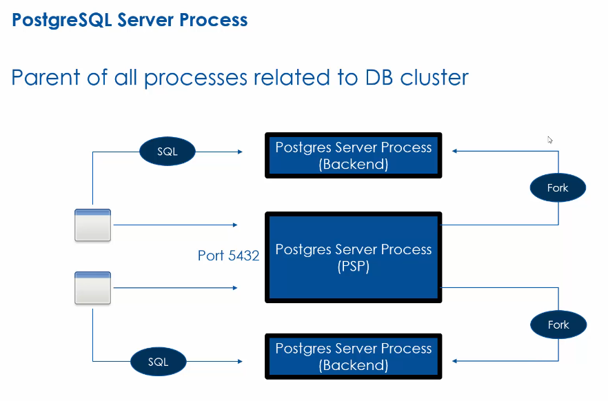
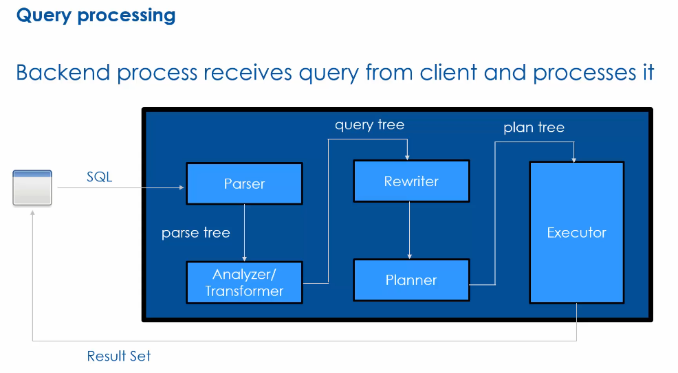
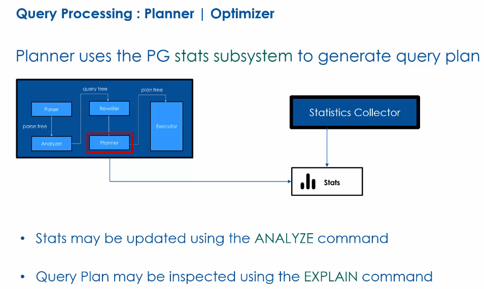
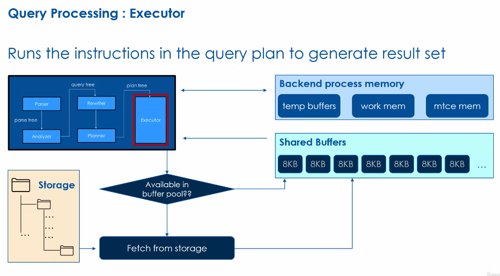
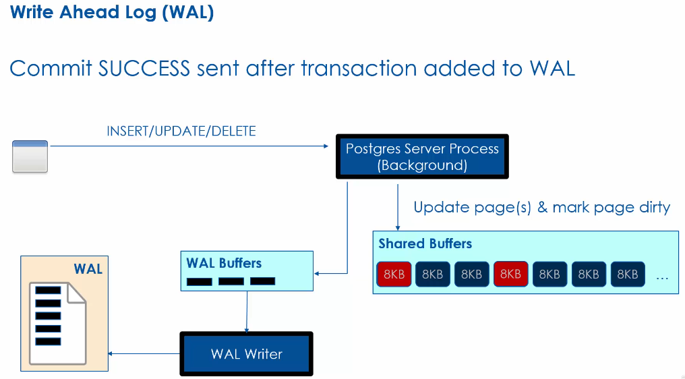
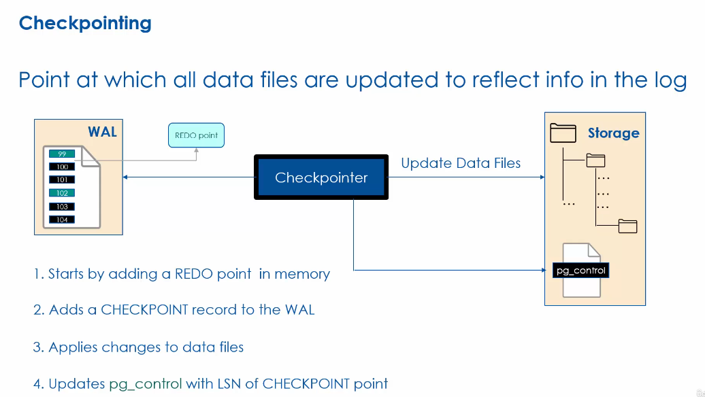
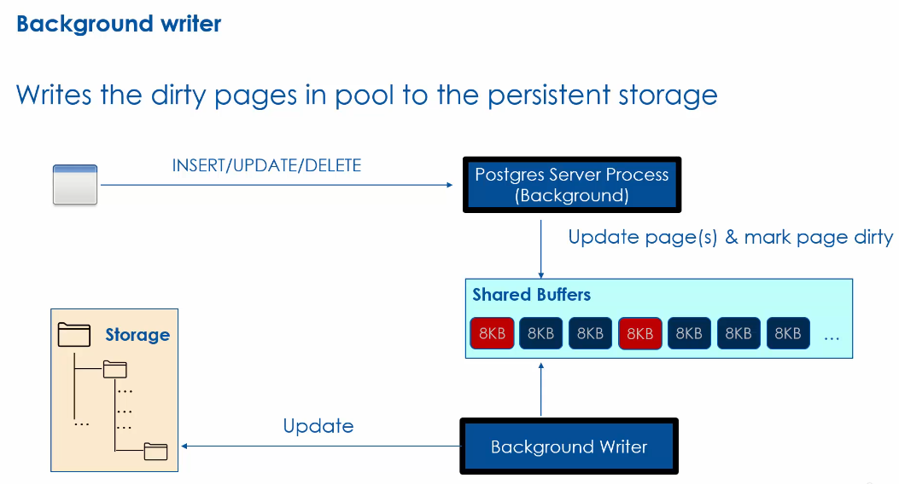
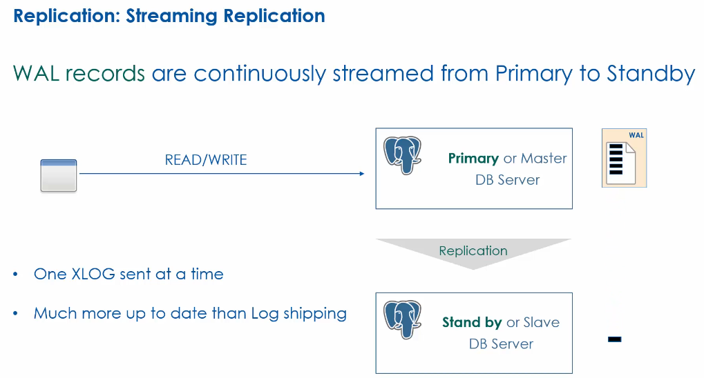
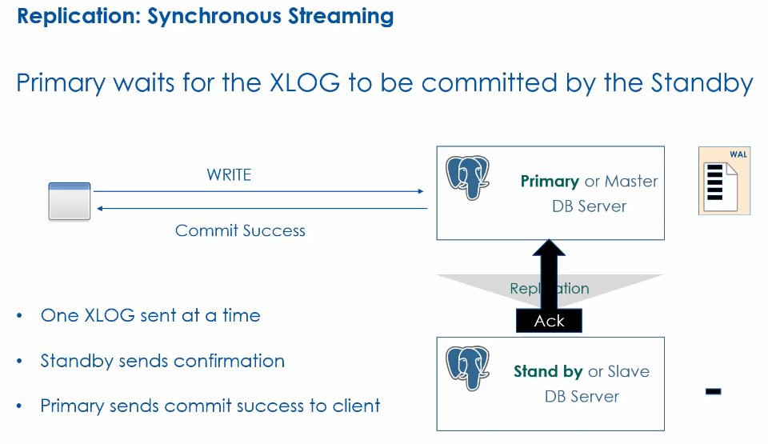

# PostgreSQL Fundamentals

- Data is stored in filesystem in attached storage
  - Data is stored in one or more 1 gb files
  - Data files are read/written to in 8KB pages
  - Page a.k.a. Block or blk

## PostgreSQL Server Process
  - Parent of all processes related to DB cluster
  - For each client connection, PSP forks a backend process to handle client request
  - Max connection is controlled using max_connection setting which is set based on Server compute



## Query Processing


- Parser - parse tree is created
- Analyzer - Query tree is created
- Rewriter - Rules are applied
- Planner - Execution instructions are created
- Executor - Executes all instructions to produce results

## Query Processing: Planner | Optimizer



- Planner uses the PG stats subsystem to generate query plan
- Stats may be updated using the `ANALYZE` command
- Query plan may be inspected using the `EXPLAIN` command

## Query Processing: Executor



- Executor runs the instructions in the query plan to generate result set.
- Shared Buffers/Buffer pool helps in reducing disk subsystem IO by caching data pages
- Other memory segments are using used by Executor to carry out specific task
  - temp buffers -> 
  - work mem -> for sort or hash in queries
  - maintenance mem -> for maintenance task like analyze, reindexing

## Buffer cache hit ratio

- Ratio of requests served from buffer pool and total requests

`Hit Ratio = (Blks_hit) / (Blks_hit + Blks_read)`

- Size controlled using shared_buffers

## Write Ahead Log (WAL)

- Commit success is sent after transaction log records are added to WAL
- Each WAL record contains the transaction log records (XLOG Record)
- Each XLOG has a unique Log Sequence Number (LSN)
- XLOG are managed in WAL segments (16 MB files)
- A transaction is marked committed only after write to WAL
- Crash recovery uses WAL to recreate state of DB



## Checkpointing - Checkpointer

- Initailly PSP (postres server process) writes DMS changes in shared_buffers & WAL.
- But eventually these dirty shared buffers are pushed to disk. This process is called "Checkpointing"
- The background process responsible for checkpointing is "Checkpointer"
- Checkpointer starts with adding a REDO point in memory.
  - This REDO point refers to the last transaction log that was included in last checkpointing.
- Checkpointer add a CHECKPOINT record to the WAL.
  - Now, all the WAL entries between REDO point and CHECKPOINT are candidates for data updates
  - In meantime, new wal records may come post CHECKPOINT, but they won't be part of current checkpointing operation
- Applies changes to data files
- Updates `pg_control` file with LSN of CHECKPOINT point
  - This file has all the information required for crash recovery



## Checkpoint Frequency

- Controlled by way of timeout & WAL log size
- May also be initiated using checkpoint command

```
show checkpoint_timeout # default 5 minutes
show max_wal_size; # default 1 gb

```

## WAL Archiver

- Archives the WAL files that are no more needed into set physical location on filesytem
  - Frees up the space
  - Archived wal(s) may be used for recreating the database

## Crash Recovery (REDO Process)

- After postgres process crash, a panic message is logged in error log
- Recovery process starts with applying the WAL/XLOGs after the last checkpoint
- For crash recovery, PSP reads `pg_control` file, and starts from last CHECKPOINT record
- Recovery time depends on number of pending XLOG

## Background writer

- Writes the dirty pages in pool to the persistent storage




## PostgreSQL High Availability

- Second DB server acts as a target for recovery
  - First server receiving WRITE connection is called "Primary" or "Master" server
  - This 2nd DB server is called "STANDBY" server
- Standby servers to which clients are not allowed to connect are called "Warm Standby" servers
- Stanby servers may also accept READONLY connections, and thus called "Hot Standby" server
- 

## Replication

- Replication is used for keeping "Primary" and "Standby" in sync
- Commonly available replications are
  - WAL based replication - Log Shipping, Streaming, Synchronous vs Asynchronous
  - Cascading replication
  - Physical replication
  - Logical replication

## Replication: Log Shipping

- WAL segments (16 mb each) are continously sent to Standby server
- The Standby server applied the received WAL segments
- One WAL Segment/File sent at a time
- Standby is not 100% in sync at all time


## Replication: Steaming Replication

- WAL records are continously streamed from Primary to Standby as soon as they are added to WAL segment without waiting for the WAL file to be filled
- The standby is much more up to date compared to Log Shipping
- One XLOG sent at a time



## Replication: Synchronous Streaming

- One XLOG sent at a time
- Primary waits for the XLOG to be committed by the Standby
- Standby sends confirmation
- Primary sends commit success to client

- This reduces the latency/replication lag, but comes at cost of performance as transaction commit time increases



## Cascading Replication

- Replication from a Standby to another Standby
- ASYNCHRONOUS replication between standby
- Supposed for Hot Standby(s)

## Physical Replication

- Byte level replication of storage device across primary and standby
  - Mirrors the file system across the primary and standby
  - Better performance compared to log shipping

## Logical Replication

- DB Table level replication using pub-sub model
- Also known as Transactional Replication
- Use cases
  - Change Data Capture (CDC)
  - Consolidation of data from multiple databases
  - Control access to subset of data
  - 

