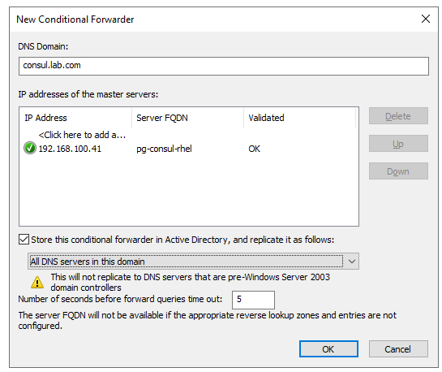

# [Single Node Consul Cluster Setup](https://developer.hashicorp.com/consul/tutorials/production-vms/deployment-guide#install-consul)
- [Consul Deployment Guide](https://developer.hashicorp.com/consul/tutorials/production-vms/deployment-guide)
- [How To Setup Consul Cluster on CentOS / RHEL 7/8](https://computingpost.medium.com/how-to-setup-consul-cluster-on-centos-rhel-7-8-7c3122c5ed7)
- [How to Install Consul Server on Ubuntu](https://www.atlantic.net/vps-hosting/how-to-install-consul-server-on-ubuntu/)

# Install Consul package
```
# Configure Repo for Consul
sudo yum install -y yum-utils
sudo yum-config-manager --add-repo https://rpm.releases.hashicorp.com/RHEL/hashicorp.repo

# install latest consul
sudo yum -y install consul

# verify installation
consul --version
```

# Create server and agent config files
```
## Create a consul system user/group
sudo groupadd --system consul
sudo useradd -s /sbin/nologin --system -g consul consul

## Create consul data and configurations directory and set ownership to consul user
sudo mkdir -p /opt/consul /var/lib/consul /etc/consul.d/certs
sudo touch /etc/consul.d/server.hcl /etc/consul.d/consul.hcl
sudo chown -R consul:consul /var/lib/consul /etc/consul.d /opt/consul
sudo chmod -R 775 /var/lib/consul /etc/consul.d /opt/consul
```

# On Consul Server only, Generate encryption key
```
consul keygen

    JVS+tAPVCJ1rrrdTKjuPTjfmaroCH4/IwX+P/j+uLkw=
```

# On Consul Server only, Generate TLS certificates
```
cd /etc/consul.d/certs

consul tls ca create
consul tls cert create -server -dc dc1

    [ansible@pg-consul-rhel consul.d]$ ls -l certs/
    total 16
    -rw-------. 1 consul consul  227 Sep  8 14:42 consul-agent-ca-key.pem
    -rw-r--r--. 1 consul consul 1074 Sep  8 14:42 consul-agent-ca.pem

scp consul-agent-ca.pem <USER>@<CLIENT_HOST_PUBLIC_IP>:/etc/consul.d/certs
```


# Setup DNS or edit /etc/hosts file to configure hostnames for all servers ( set on all nodes).
```
sudo vim /etc/hosts

    192.168.100.41 pg-consul-rhel pg-consul-rhel.lab.com
```

# On Consul Server, create server config file
```
sudo nano /etc/consul.d/server.hcl

    server = true
    bootstrap_expect = 1
    server_rejoin_age_max = "8760h"
    bind_addr = "192.168.100.41"
    client_addr = "0.0.0.0"

    ui_config {
      enabled = true
    }
```

# On Consul server, create agent config file
```
sudo nano /etc/consul.d/consul.hcl

    datacenter = "dc1"
    data_dir = "/opt/consul"
    encrypt = "qDOPBEr+/oUVeOFQOnVypxwDaHzLrD+lvjo5vCEBbZ0="

    tls {
      defaults {
          ca_file = "/etc/consul.d/certs/consul-agent-ca.pem"
          cert_file = "/etc/consul.d/certs/dc1-server-consul-0.pem"
          key_file = "/etc/consul.d/certs/dc1-server-consul-0-key.pem"

          verify_incoming = false
          verify_outgoing = true
      }
      internal_rpc {
          verify_server_hostname = false
      }
    }

    auto_encrypt {
      allow_tls = true
    }

    retry_join = ["192.168.100.41"]

    acl {
      enabled = true
      #default_policy = "allow"
      default_policy = "deny"
      #down_policy = "extend-cache"
      enable_token_persistence = true
      tokens = {
        default = "078144ad-4e36-eb66-42b5-eea719ba517e"
        agent = "9956cac9-e471-9cd7-50d9-d83cef049ce5"
      }
    }
```

## On cilent host, copy `ca_file` & `encrypt` key from Consul server
```
scp ansible@pg-consul-rhel:/etc/consul.d/certs/consul-agent-ca.pem /etc/consul.d/certs
```

## On client host, setup Consul service (agent)
```
sudo nano /etc/consul.d/consul.hcl

    server = false

    datacenter = "dc1"
    domain = "lab.com"
    data_dir = "/opt/consul"
    encrypt = "qDOPBEr+/oUVeOFQOnVypxwDaHzLrD+lvjo5vCEBbZ0="
    #log_file = "/var/log/consul/consul.log"

    tls {
      defaults {
          ca_file = "/etc/consul.d/certs/consul-agent-ca.pem"

          verify_incoming = false
          verify_outgoing = true
      }
      internal_rpc {
          verify_server_hostname = false
      }
    }

    auto_encrypt {
      tls = true
    }

    acl {
      enabled = true
      default_policy = "deny"
      down_policy = "extend-cache"
      enable_token_persistence = true
      tokens = {
        default = "078144ad-4e36-eb66-42b5-eea719ba517e"
        agent = "9956cac9-e471-9cd7-50d9-d83cef049ce5"
      }
    }

    node_name = "ryzen9"                  # Name of client host
    bind_addr = "192.168.100.1"         # IP of client host
    advertise_addr = "192.168.100.1"    # IP of client host

    client_addr = "0.0.0.0"
    retry_join = ["192.168.100.41","pg-consul-rhel"]      # IP of Consul server

    enable_script_checks = true

```

## On Consul Server, Allow consul ports on the firewall
```
# TCP ports
sudo firewall-cmd --permanent --add-port=8300/tcp
sudo firewall-cmd --permanent --add-port=8301/tcp
sudo firewall-cmd --permanent --add-port=8302/tcp
sudo firewall-cmd --permanent --add-port=8400/tcp
sudo firewall-cmd --permanent --add-port=8500/tcp
sudo firewall-cmd --permanent --add-port=8600/tcp
sudo firewall-cmd --permanent --add-port=80/tcp
sudo firewall-cmd --permanent --add-port=443/tcp

# UDP ports
sudo firewall-cmd --permanent --add-port=8301/udp
sudo firewall-cmd --permanent --add-port=8302/udp
sudo firewall-cmd --permanent --add-port=8600/udp

# Apply changes
sudo firewall-cmd --reload
```

# Validate consul config files on all servers and hosts
```
sudo consul validate /etc/consul.d/
```

## On both consul server & client host, create Consul service if not exists
```
sudo vim /etc/systemd/system/consul.service


    [Unit]
    Description="HashiCorp Consul - A service mesh solution"
    Documentation=https://www.consul.io/
    Requires=network-online.target
    After=network-online.target
    ConditionFileNotEmpty=/etc/consul.d/consul.hcl

    [Service]
    EnvironmentFile=-/etc/consul.d/consul.env
    User=consul
    Group=consul
    ExecStart=/usr/local/bin/consul agent -config-dir=/etc/consul.d/
    ExecReload=/bin/kill --signal HUP $MAINPID
    KillMode=process
    KillSignal=SIGTERM
    Restart=on-failure
    LimitNOFILE=65536

    [Install]
    WantedBy=multi-user.target

```

# Start consul service before bootstrapping
```
sudo systemctl enable consul
sudo systemctl start consul
sudo systemctl status consul
```

# [On Consul Server, bootstrap ACLs and generate Global Token/Secret](https://developer.hashicorp.com/consul/tutorials/production-vms/deployment-guide#create-the-initial-bootstrap-token)
```
export CONSUL_CACERT=/etc/consul.d/certs/consul-agent-ca.pem

consul acl bootstrap

    [saanvi@pg-consul-rhel ~]consul acl bootstrapap
    AccessorID:       a85fxxxx-xxxx-xxxx-xxxx-xxxxxxxdff47
    SecretID:         0781xxxx-xxxx-xxxx-xxxx-xxxxxxxa517e
    Description:      Bootstrap Token (Global Management)
    Local:            false
    Create Time:      2025-09-08 16:02:13.528281805 +0530 IST
    Policies:
    00000000-0000-0000-0000-000000000001 - global-management


echo 'export CONSUL_MGMT_TOKEN="d0f2xxxx-xxxx-xxxx-xxxx-xxxxxxxba162"' >> ~/.bashrc

export CONSUL_MGMT_TOKEN="<Token SecretID from previous step>"

HINT: The secret generate in above "acl token create" command would be used by Patroni
```

# [On Consul Server, Create an ACL policy for auto-encrypt/agent](https://developer.hashicorp.com/consul/tutorials/production-vms/deployment-guide#create-the-initial-bootstrap-token)
```
sudo mkdir -p /etc/consul.d/policies
sudo chown -R consul:consul /etc/consul.d/policies

cd /etc/consul.d/policies

# Create /etc/consul.d/policies/node-policy.hcl
sudo nano /etc/consul.d/policies/node-policy.hcl

    agent_prefix "" {
      policy = "write"
    }
    node_prefix "" {
      policy = "write"
    }
    service_prefix "" {
      policy = "write"
    }
    session_prefix "" {
      policy = "write"
    }
    key_prefix "" {
      policy = "write"
    }
    key_prefix "service/" {
      policy = "write"
    }

# Create "Patroni-policy"

    service_prefix "" {
      policy = "write"
    }
    key_prefix "" {
      policy = "write"
    }
    session_prefix "" {
      policy = "write"
    }
    session_prefix "" {
      policy = "read"
    }
    agent_prefix "" {
      policy = "write"
    }
    node_prefix "" {
      policy = "write"
    }
    key_prefix "service/" {
      policy = "write"
    }

# Ensure to create environment variable
export CONSUL_MGMT_TOKEN="<Token SecretID from previous step>"

# Generate the Consul node ACL policy with the newly created policy file.
consul acl policy create \
  -token=${CONSUL_MGMT_TOKEN} \
  -name node-policy \
  -rules @policies/node-policy.hcl


# Create the node token with the newly created policy
consul acl token create \
  -token=${CONSUL_MGMT_TOKEN} \
  -description "node token" \
  -policy-name node-policy

# Add node token to consul agent
export NODE_POLICY_TOKEN="<Node Token SecretID from previous step>"
consul acl set-agent-token \
  -token=${CONSUL_MGMT_TOKEN} \
  agent "$NODE_POLICY_TOKEN"


    ACL token "agent" set successfully
```

# Verify
```
export CONSUL_HTTP_TOKEN="<Global Bootstrap Token Secret Generate initially >"
consul members
    Node                    Address              Status  Type    Build   Protocol  DC   Partition  Segment
    pg-consul-rhel.lab.com  192.168.100.41:8301  alive   server  1.21.3  2         dc1  default    <all>

# Get additional metadata
consul members -detailed

    [ansible@pg-consul-rhel ~]$ consul members -detailed
    Node            Address              Status  Tags
    pg-consul-rhel  192.168.100.41:8301  alive   acls=0,ap=default,build=1.21.0:4e96098f,dc=dc1,ft_fs=1,ft_si=1,grpc_tls_port=8503,id=7d203605-cebf-e7e7-aac2-f6fc6646253a,port=8300,raft_vsn=3,role=consul,segment=<all>,vsn=2,vsn_max=3,vsn_min=2,wan_join_port=8302
```

# Verify leader
```
curl http://127.0.0.1:8500/v1/status/leader
```

# Open website http://pg-consul-rhel:8500/ui/ from ryzen9 machine
Use CONSUL_HTTP_TOKEN for login
```
echo $CONSUL_HTTP_TOKEN
```


## Error/Fix: No cluster leader

```
{
  "server": true,
  "server_rejoin_age_max": "8760h"
}

```

## Configure NGinx as a Reverse Proxy
```

apt-get install nginx -y
rm -rf /etc/nginx/sites-enabled/default

sudo nano /etc/nginx/sites-available/consul.conf

server {
listen 80 ;
server_name 192.168.100.41;
root /var/lib/consul;
location / {
proxy_pass http://127.0.0.1:8500;
proxy_set_header   X-Real-IP $remote_addr;
proxy_set_header   Host      $http_host;
}
}

sudo mkdir /etc/nginx/sites-enabled
sudo ln -s /etc/nginx/sites-available/consul.conf /etc/nginx/sites-enabled/

sudo nginx -t

sudo systemctl restart nginx
```

## Error/Fix: agent: startup error: error="refusing to rejoin cluster because server has been offline for more than the configured server_rejoin_age_max (168h0m0s) - consider wiping your data dir"
### Error =>
```
[ansible@pg-consul-rhel ~]$ 
[ansible@pg-consul-rhel ~]$ sudo systemctl status consul.service 
● consul.service - Consul Service Discovery Agent
     Loaded: loaded (/etc/systemd/system/consul.service; enabled; preset: disabled)
     Active: active (running) since Thu 2025-08-07 19:18:56 IST; 54s ago
       Docs: https://www.consul.io/
   Main PID: 1121 (consul)
      Tasks: 8 (limit: 48752)
     Memory: 101.7M
        CPU: 96ms
     CGroup: /system.slice/consul.service
             └─1121 /usr/local/bin/consul agent -server -ui -advertise=192.168.100.41 -bind=192.168.100.41 -data-dir=/var/lib/consul -node=pg-consul-rhel -config-dir=/etc/consul.d


Aug 07 19:19:57 pg-consul-rhel.lab.com consul[6293]: 2025-08-07T19:19:57.204+0530 [WARN]  agent: The 'ui' field is deprecated. Use the 'ui_config.enabled' field instead.
Aug 07 19:19:57 pg-consul-rhel.lab.com consul[6293]: 2025-08-07T19:19:57.204+0530 [WARN]  agent: BootstrapExpect is set to 1; this is the same as Bootstrap mode.
Aug 07 19:19:57 pg-consul-rhel.lab.com consul[6293]: 2025-08-07T19:19:57.204+0530 [WARN]  agent: bootstrap = true: do not enable unless necessary
Aug 07 19:19:57 pg-consul-rhel.lab.com consul[6293]: 2025-08-07T19:19:57.207+0530 [WARN]  agent.auto_config: skipping file /etc/consul.d/consul.env, extension must be .hcl or .json, or config format must be set
Aug 07 19:19:57 pg-consul-rhel.lab.com consul[6293]: 2025-08-07T19:19:57.207+0530 [WARN]  agent.auto_config: The 'ui' field is deprecated. Use the 'ui_config.enabled' field instead.
Aug 07 19:19:57 pg-consul-rhel.lab.com consul[6293]: 2025-08-07T19:19:57.207+0530 [WARN]  agent.auto_config: BootstrapExpect is set to 1; this is the same as Bootstrap mode.
Aug 07 19:19:57 pg-consul-rhel.lab.com consul[6293]: 2025-08-07T19:19:57.207+0530 [WARN]  agent.auto_config: bootstrap = true: do not enable unless necessary
Aug 07 19:19:57 pg-consul-rhel.lab.com consul[6293]: 2025-08-07T19:19:57.207+0530 [ERROR] agent: startup error: error="refusing to rejoin cluster because server has been offline for more than the configured server_rejoin_age_max (168h0m0s) - consider wiping your data dir"
Aug 07 19:20:07 pg-consul-rhel.lab.com consul[6293]: 2025-08-07T19:20:07.207+0530 [ERROR] agent: startup error: error="refusing to rejoin cluster because server has been offline for more than the configured server_rejoin_age_max (168h0m0s) - consider wiping your data dir"
Aug 07 19:20:17 pg-consul-rhel.lab.com consul[6293]: 2025-08-07T19:20:17.208+0530 [ERROR] agent: startup error: error="refusing to rejoin cluster because server has been offline for more than the configured server_rejoin_age_max (168h0m0s) - consider wiping your data dir"

```

### Fix
```
# find consul config directory
sudo systemctl cat consul | grep config

# create config file
sudo vim /etc/consul.d/server.json
    {
    "server": true,
    "server_rejoin_age_max": "8760h"
    }

sudo chown consul:consul /etc/consul.d/server.json
sudo chmod 0700 /etc/consul.d/server.json

# validate config file
sudo -u consul consul validate /etc/consul.d

# restart service
sudo systemctl restart consul
sudo systemctl status consul

# Check service error
sudo journalctl -u consul -f --since '1 minute ago'

# check web portal
pg-consul-rhel:8500/ui
```


## On client `ryzen9`, Register PostgreSQL as a Service
```
# Register service on client
sudo vim /etc/consul.d/postgresql.json
sudo chown consul:consul /etc/consul.d/postgresql.json
sudo chmod 0700 /etc/consul.d/postgresql.json

# Reload consul on client
sudo consul reload


{
  "service": {
    "name": "postgresql-16-main",
    "port": 5432,
    "tags": ["primary", "db"],
    "check": {
      "id": "pgsql-tcp-check",
      "name": "PostgreSQL 16-main TCP on port 5432",
      "tcp": "localhost:5432",
      "interval": "10s",
      "timeout": "1s"
    }
  }
}
```

# Troubleshooting commands
```
# validate consul configurations
sudo consul validate /etc/consul.d

# get ACL tokens
consul acl token list -format=json | jq '.[] | {AccessorID, Description, Policies}'

# get members
consul members

# get gossip key in keyring
consul keyring -list

# Remove the keyring
sudo rm -f /opt/consul/serf/local.keyring
sudo rm -f /opt/consul/serf/remote.keyring

# reset settings
cd /etc/consul.d/
sudo systemctl stop consul.service
sudo rm -f /opt/consul/serf/local.keyring
sudo rm -f /opt/consul/serf/remote.keyring
sudo systemctl start consul.service
sudo systemctl status consul.service

# test if things are fine
consul members


# remove old logs
sudo su

rm -f /var/log/patroni/patroni.log
rm -f /var/log/postgresql/postgresql-Wed.log

rm -rf data*
```


# Install & Configure CoreDNS on Consul Server to map DNS consul port 8600 to port 53
  # Objective -- Make CoreDNS answer *.consul and *.consul.lab.com queries on standard DNS port 53 and forwards them to Consul’s DNS on 127.0.0.1:8600

## 1) Download binary from github
```
# on pg-consul-rhel (run as your normal sudo user)
CORE_DNS_VER="1.12.4"   # change if you want a different version

cd /usr/local/bin
wget -q "https://github.com/coredns/coredns/releases/download/v${CORE_DNS_VER}/coredns_${CORE_DNS_VER}_linux_amd64.tgz"
tar xzf "coredns_${CORE_DNS_VER}_linux_amd64.tgz"

sudo chown root:root coredns
sudo chmod 0755 coredns

rm -f coredns_*

check permissions
-----------------
ls -lZ /usr/local/bin/coredns
    # Ideal
    -rwxr-xr-x. root root system_u:object_r:bin_t:s0 /usr/local/bin/coredns
    # Working on pg-consul-rhel
    -rwxr-xr-x. 1 root root unconfined_u:object_r:bin_t:s0 67911832 Nov 22  2024 /usr/local/bin/coredns

sudo restorecon -v /usr/local/bin/coredns

```

## 2) Create config dir
```
sudo mkdir -p /etc/coredns
sudo chown root:root /etc/coredns
sudo chmod 0755 /etc/coredns
```

## 2) Create Corefile
  `sudo tee /etc/coredns/Corefile > /dev/null <<'EOF'`
```
# Default: forward all other queries to upstream AD DNS and public DNS as fallback
.:53 {
    forward . 192.168.100.10 8.8.8.8  # primary: your Windows DNS; fallback: Google
    log
    errors
    cache 30
    health
}

# Serve consul.lab.com by rewriting queries to Consul's service domain and forwarding to Consul DNS
consul.lab.com:53 {
    rewrite name suffix .consul.lab.com .service.consul
    forward . 127.0.0.1:8600
    log
    errors
    cache 30
}

# Serve plain "consul" domain directly to Consul DNS (so master.pg-cls2-prod.consul works)
consul:53 {
    forward . 127.0.0.1:8600
    log
    errors
    cache 30
}
EOF

```

### Notes about the Corefile
```
.:53 block handles general DNS (forwards to AD DNS and a public resolver as fallback).

consul.lab.com:53 rewrites queries like master.pg-cls2-prod.consul.lab.com → master.pg-cls2-prod.service.consul and forwards to Consul.

consul:53 handles short names *.consul.

log and errors helpful while testing (you can remove later).
```

## 3) Create systemd unit for CoreDNS
`sudo tee /etc/systemd/system/coredns.service > /dev/null <<'EOF'`

### Content
```
[Unit]
Description=CoreDNS DNS Server
After=network.target

[Service]
User=root
ExecStart=/usr/local/bin/coredns -conf /etc/coredns/Corefile
Restart=on-failure
LimitNOFILE=65536

[Install]
WantedBy=multi-user.target
EOF

```

## 4) SELinux (if enabled) — allow CoreDNS to bind port 53
If SELinux is Enforcing, allow port 53 for a custom binary:

```
# install semanage tool if not present
sudo yum install -y policycoreutils-python-utils

# add port contexts for CoreDNS (tcp & udp)
sudo semanage port -a -t dns_port_t -p tcp 53 || true
sudo semanage port -a -t dns_port_t -p udp 53 || true

```

## 5) Firewall: open DNS port 53 (tcp & udp)

```
# if firewalld is running
sudo firewall-cmd --permanent --add-port=53/udp
sudo firewall-cmd --permanent --add-port=53/tcp
sudo firewall-cmd --reload

# if using iptables or nft separately, add equivalent rules

```

## 6) Start and enable CoreDNS

```
sudo systemctl daemon-reload
sudo systemctl enable --now coredns
sudo systemctl status coredns --no-pager


sudo journalctl -u coredns -f

```

## 7) Test locally on pg-consul-rhel
```
# test rewritten domain
dig @127.0.0.1 master.pg-cls2-prod.consul.lab.com +short

# test short consul name (if you prefer)
dig @127.0.0.1 master.pg-cls2-prod.consul +short

# ensure forwarding fallback works for other domains
dig @127.0.0.1 google.com +short

```

## 8) Add Windows DNS conditional forwarder (on 192.168.100.10)



Now configure your Windows DNS server to forward consul.lab.com (or consul) to 192.168.100.41:

Open DNS Manager → Right-click Conditional Forwarders → New Conditional Forwarder.

DNS Domain: consul.lab.com (and optionally consul if your Windows DNS accepts that)

IP address of the master server: 192.168.100.41

Save. (Windows will forward ordinary DNS queries for that zone to CoreDNS on port 53.)

Note: Windows DNS GUI forwards to port 53 only. That’s why CoreDNS must listen on port 53.

## 9) Test from a client machine (or your app host)

From a client machine that uses 192.168.100.10 as resolver:

```
# test the final desired name:
dig master.pg-cls2-prod.consul.lab.com

# or the short name (if search domain includes lab.com)
dig master.pg-cls2-prod.consul

# forcing Windows DNS
dig @192.168.100.10 master.pg-cls2-prod.consul.lab.com


```


## 10) Troubleshooting tips

If dig @127.0.0.1 works but dig @192.168.100.10 doesn’t:

Confirm Windows DNS conditional forwarder exists and points to 192.168.100.41.

Confirm CoreDNS is reachable on port 53 from Windows (telnet 192.168.100.41 53 or nc -zv 192.168.100.41 53).

If CoreDNS fails to start: sudo journalctl -u coredns -b and sudo systemctl status coredns -l.

SELinux: if Enforcing, see sudo ausearch -m avc -ts recent for denials. You may need to label the binary, or run CoreDNS as root (we used root) and set port context above.

If port 53 already used by named/bind/systemd-resolved, stop/disable that service or pick another host for CoreDNS.

If you prefer running CoreDNS as non-root, give binary capability to bind low port:

sudo setcap 'cap_net_bind_service=+ep' /usr/local/bin/coredns


then change systemd User to a dedicated coredns user (requires SELinux adjustments).


## 11) Optional: map service.consul directly to consul.lab.com

If you prefer a different rewrite (e.g. *.consul.lab.com → *.service.consul), you can adapt the rewrite line in the Corefile accordingly:

rewrite name suffix .consul.lab.com .service.consul


