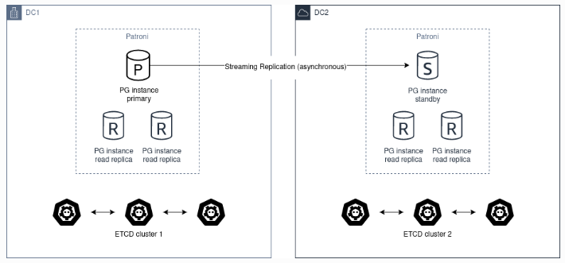
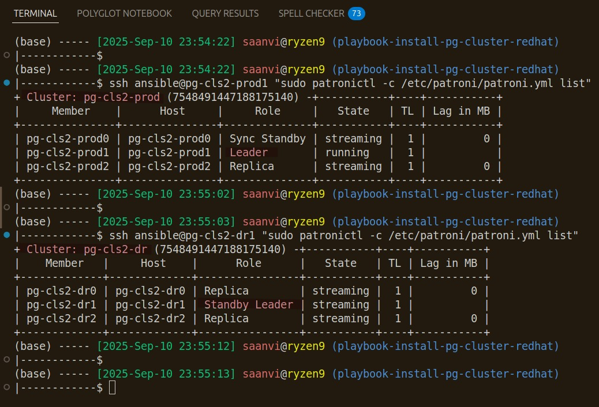
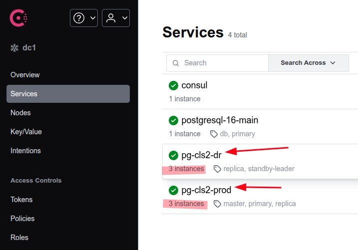

# Install PostgreSQL Cluster
- [Patroni and pgBackRest combined](https://pgstef.github.io/2022/07/12/patroni_and_pgbackrest_combined.html)
> PostgreSQL + Patroni + pgBackRest + Conul + s3/local repo

# [Patroni - HA multi datacenter](https://patroni.readthedocs.io/en/latest/ha_multi_dc.html#asynchronous-replication)







## Does all replicas in multi dc cluster setup has same system identifier
```
ansible all -i hosts__multi_datacenter.yml -u ansible -b -m shell -a "/usr/pgsql-16/bin/pg_controldata -D /var/lib/pgsql/16/data | grep system"
```

# Failover from dc1 (`pg-cls2-prod`) to dc2 (`pg-cls2-dr`)
```
# Check present leaders on Clusters
ansible dc1_leader -i hosts__multi_datacenter.yml -u ansible -b -m shell -a "patronictl -c /etc/patroni/patroni.yml list"
ansible dc2_leader -i hosts__multi_datacenter.yml -u ansible -b -m shell -a "patronictl -c /etc/patroni/patroni.yml list"

# Failover to preferred leaders, and wait for healthy state (streaming, running), and timeline
ansible dc1_leader -i hosts__multi_datacenter.yml -u ansible -b -m shell \
    -a "patronictl -c /etc/patroni/patroni.yml failover pg-cls2-prod --candidate pg-cls2-prod1 --force"
ansible dc2_leader -i hosts__multi_datacenter.yml -u ansible -b -m shell \
    -a "patronictl -c /etc/patroni/patroni.yml failover pg-cls2-dr --candidate pg-cls2-dr1 --force"

# Put current Primary Cluster to maintenance mode
ansible dc1_leader -i hosts__multi_datacenter.yml -u ansible -b -m shell \
    -a "patronictl -c /etc/patroni/patroni.yml pause pg-cls2-prod --wait"

# On new Primary Cluster, remove standby_cluster config using patronictl
ansible dc2_leader -i hosts__multi_datacenter.yml -u ansible -b -m shell \
    -a "patronictl -c /etc/patroni/patroni.yml edit-config --set standby_cluster=null --force"

# Above step should should convert the old Standby Cluster to Primary Cluster. Verify using below command
ansible dc2_leader -i hosts__multi_datacenter.yml -u ansible -b -m shell -a "patronictl -c /etc/patroni/patroni.yml list"

# IMPORTANT: Wait for new Primary Cluster to have "streaming" or "running" state

# Run below command if new leader is not correct
ansible dc2_leader -i hosts__multi_datacenter.yml -u ansible -b -m shell \
    -a "patronictl -c /etc/patroni/patroni.yml failover pg-cls2-dr --candidate pg-cls2-dr1 --force"

# Now, asssuming the old Primary comes up, and is still in Primary Cluster role

# On old Primary Cluster, to demote to Standby Cluster, add standby_cluster config using patronictl
ansible dc1_leader -i hosts__multi_datacenter.yml -u ansible -b -m shell \
    -a "patronictl -c /etc/patroni/patroni.yml edit-config --set standby_cluster='{host: pg-cls2-dr1, port: 5432}' --force"

# Above step should should convert the old Primary Cluster to Standby Cluster. Verify
ansible dc1_leader -i hosts__multi_datacenter.yml -u ansible -b -m shell -a "patronictl -c /etc/patroni/patroni.yml list"

# Remove new Standby Cluster from maintenance mode
ansible dc1_leader -i hosts__multi_datacenter.yml -u ansible -b -m shell -a "patronictl -c /etc/patroni/patroni.yml resume pg-cls2-prod --wait"

# With above steps, All the nodes are supposed to go have "in archive recovery" -> "streaming" state
ansible dc2_leader -i hosts__multi_datacenter.yml -u ansible -b -m shell -a "patronictl -c /etc/patroni/patroni.yml list"

# Once New Standby Cluster leader node is back to "steaming" state, reinit other Standby Cluster nodes if taking time to have state transition from "in archive recovery" to "steaming"
ansible dc2_leader -i hosts__multi_datacenter.yml -u ansible -b -m shell -a \
    "patronictl -c /etc/patroni/patroni.yml reinit pg-cls2-prod pg-cls2-prod0 --force"
ansible dc2_leader -i hosts__multi_datacenter.yml -u ansible -b -m shell -a \
    "patronictl -c /etc/patroni/patroni.yml reinit pg-cls2-prod pg-cls2-prod2 --force"

# Failover to preferred leaders, and wait for healthy state (streaming, running), and timeline
ansible dc2_leader -i hosts__multi_datacenter.yml -u ansible -b -m shell \
    -a "patronictl -c /etc/patroni/patroni.yml failover pg-cls2-dr --candidate pg-cls2-dr1 --force"

# Validate both cluster together. Verify Role, State, and Timeline
ansible dc1_leader -i hosts__multi_datacenter.yml -u ansible -b -m shell -a "patronictl -c /etc/patroni/patroni.yml list"
ansible dc2_leader -i hosts__multi_datacenter.yml -u ansible -b -m shell -a "patronictl -c /etc/patroni/patroni.yml list"

# Validate backup on new Primary
ansible dc2_leader -i hosts__multi_datacenter.yml -u ansible -b -m shell -a "sudo -iu postgres pgbackrest --stanza=pg-cls2 check"

  # Error: has a stanza-create been performed?
  ansible dc2_leader -i hosts__multi_datacenter.yml -u ansible -b -m shell -a "sudo -iu postgres pgbackrest --stanza=pg-cls2 stanza-create"
  ansible dc2_leader -i hosts__multi_datacenter.yml -u ansible -b -m shell -a "sudo -iu postgres pgbackrest --stanza=pg-cls2 backup"
  ansible dc2_leader -i hosts__multi_datacenter.yml -u ansible -b -m shell -a "sudo -iu postgres pgbackrest --stanza=pg-cls2 check"
  ansible dc2_leader -i hosts__multi_datacenter.yml -u ansible -b -m shell -a "sudo -iu postgres pgbackrest --stanza=pg-cls2 info"


```

# Failback to dc1 (`pg-cls2-prod`) from dc2 (`pg-cls2-dr`)
```
# Check present leaders on Clusters
ansible dc2_leader -i hosts__multi_datacenter.yml -u ansible -b -m shell -a "patronictl -c /etc/patroni/patroni.yml list"
ansible dc1_leader -i hosts__multi_datacenter.yml -u ansible -b -m shell -a "patronictl -c /etc/patroni/patroni.yml list"

# Failover to preferred leaders, and wait for healthy state (streaming, running), and timeline
ansible dc1_leader -i hosts__multi_datacenter.yml -u ansible -b -m shell \
    -a "patronictl -c /etc/patroni/patroni.yml failover pg-cls2-prod --candidate pg-cls2-prod1 --force"
ansible dc2_leader -i hosts__multi_datacenter.yml -u ansible -b -m shell \
    -a "patronictl -c /etc/patroni/patroni.yml failover pg-cls2-dr --candidate pg-cls2-dr1 --force"

# Put current Primary Cluster to maintenance mode
ansible dc2_leader -i hosts__multi_datacenter.yml -u ansible -b -m shell \
    -a "patronictl -c /etc/patroni/patroni.yml pause pg-cls2-dr --wait"

# On new Primary Cluster, remove standby_cluster config using patronictl
ansible dc1_leader -i hosts__multi_datacenter.yml -u ansible -b -m shell \
    -a "patronictl -c /etc/patroni/patroni.yml edit-config --set standby_cluster=null --force"

# Above step should should convert the old Standby Cluster to Primary Cluster. Verify using below command
ansible dc1_leader -i hosts__multi_datacenter.yml -u ansible -b -m shell -a "patronictl -c /etc/patroni/patroni.yml list"

# IMPORTANT: Wait for new Primary Cluster to have "streaming" or "running" state

# Run below command if new leader is not correct
ansible dc1_leader -i hosts__multi_datacenter.yml -u ansible -b -m shell \
    -a "patronictl -c /etc/patroni/patroni.yml failover pg-cls2-prod --candidate pg-cls2-prod1 --force"

# Now, asssuming the old Primary comes up, and is still in Primary Cluster role

# On old Primary Cluster, to demote to Standby Cluster, add standby_cluster config using patronictl
ansible dc2_leader -i hosts__multi_datacenter.yml -u ansible -b -m shell \
    -a "patronictl -c /etc/patroni/patroni.yml edit-config --set standby_cluster='{host: pg-cls2-prod1, port: 5432}' --force"

# Above step should should convert the old Primary Cluster to Standby Cluster. Verify
ansible dc2_leader -i hosts__multi_datacenter.yml -u ansible -b -m shell -a "patronictl -c /etc/patroni/patroni.yml list"

# Remove new Standby Cluster from maintenance mode
ansible dc2_leader -i hosts__multi_datacenter.yml -u ansible -b -m shell -a "patronictl -c /etc/patroni/patroni.yml resume pg-cls2-dr --wait"

# With above steps, All the nodes are supposed to go have "in archive recovery" -> "streaming" state
ansible dc2_leader -i hosts__multi_datacenter.yml -u ansible -b -m shell -a "patronictl -c /etc/patroni/patroni.yml list"

# Failover to preferred leaders, and wait for healthy state (streaming, running), and timeline
ansible dc2_leader -i hosts__multi_datacenter.yml -u ansible -b -m shell \
    -a "patronictl -c /etc/patroni/patroni.yml failover pg-cls2-dr --candidate pg-cls2-dr1 --force"

# Validate both cluster together. Verify Role, State, and Timeline
ansible dc1_leader -i hosts__multi_datacenter.yml -u ansible -b -m shell -a "patronictl -c /etc/patroni/patroni.yml list"
ansible dc2_leader -i hosts__multi_datacenter.yml -u ansible -b -m shell -a "patronictl -c /etc/patroni/patroni.yml list"

# Validate backup on new Primary
ansible dc1_leader -i hosts__multi_datacenter.yml -u ansible -b -m shell -a "sudo -iu postgres pgbackrest --stanza=pg-cls2 check"

  # Error: has a stanza-create been performed?
  ansible dc1_leader -i hosts__multi_datacenter.yml -u ansible -b -m shell -a "sudo -iu postgres pgbackrest --stanza=pg-cls2 stanza-create"
  ansible dc1_leader -i hosts__multi_datacenter.yml -u ansible -b -m shell -a "sudo -iu postgres pgbackrest --stanza=pg-cls2 backup"
  ansible dc1_leader -i hosts__multi_datacenter.yml -u ansible -b -m shell -a "sudo -iu postgres pgbackrest --stanza=pg-cls2 check"


```

# Troubleshooting

```
# check what is using port 8008
sudo ss -lntp | grep 8008

# check if master DNS is working
dig @192.168.100.41 -p 8600 master.pg-cls2-prod.service.consul
dig master.pg-cls2-prod.service.dc1.lab.com


# check file settings. (2 lines before and 3 lines after)
sudo grep -B 2 -A 3 "agent" /etc/consul.d/consul.hcl

# create pgbackrest stanza
sudo su - postgres
pgbackrest --stanza=pg-cls2 stanza-create


SELECT pid, client_addr, state, sync_state, write_lag, replay_lag
FROM pg_stat_replication;

# On Standby Cluster leader, Check for redo & checkpoint LSN, and whether they are moving forward
tail -n 1000 -f postgresql-Thu.log  | grep redo

# On Standby Cluster leader, Check what WAL it is waiting for
grep "requested" postgresql-Thu.log


# for consul error, its better to remove Key/Value for service in consul


# Check if aws s3 bucket is accessible
sudo dnf install -y awscli

ansible dc1 -i hosts__multi_datacenter.yml -m service -a "name=patroni state=stopped" -u ansible -b
ansible dc1 -i hosts__multi_datacenter.yml -m service -a "name=patroni state=stopped" -u ansible -b


export AWS_ACCESS_KEY_ID=XXXXXXXXXXXXXXXXXXXXXXX
export AWS_SECRET_ACCESS_KEY=XXXXXXXXXXXXXXXXXXXXXXXXXXXXX

# now test connectivity. Should return all existing backup folders
aws s3 ls s3://s3bucketname/pg-backups/backup/
aws s3 ls s3://s3bucketname/pg-backups/archive/

# cleanup older backup/archive for pgbackrest-stanza
aws s3 rm s3://s3bucketname/pg-backups/backup/pg-cls2/ --recursive
aws s3 rm s3://s3bucketname/pg-backups/archive/pg-cls2/ --recursive

```

# Adhoc Ansible Command for Reset

```
# Help on ansible-doc
ansible-doc -l
ansible-doc file

# stop patroni on all servers. "-u" means remote user. "-b" means become.
ansible dc1 -i hosts__multi_datacenter.yml -m service -a "name=patroni state=stopped" -u ansible -b
ansible dc1 -i hosts__multi_datacenter.yml -m shell -a "rm -rf /var/lib/pgsql/16/data/* /var/spool/pgbackrest/*" -u ansible -b

sudo -u postgres pgbackrest --stanza=pg-cls2 --type=standby --target-timeline=22 restore --force
sudo -u postgres cat /var/lib/pgsql/16/data/postgresql.auto.conf


# on leader node, delete contents of pgdata directory
sudo rm -rf /var/lib/pgsql/16/data/*

# on leader node, restore pgdata using pgbackrest
sudo -u postgres pgbackrest --stanza=pg-cls2 --delta restore
    or
    # when error: "target timeline 17 forked from backup timeline 16 at 0/4e000000 which is before backup lsn of 0/50000028"
    pgbackrest --stanza=pg-cls2 restore --force --type=immediate
    or
    pgbackrest --stanza=pg-cls2 restore --force --archive-mode=off
    or
    # force timeline similar to Primary Cluster
    pgbackrest --stanza=pg-cls2 --type=standby --target-timeline=22 restore --force


# on leader node, start patroni
systemctl restart patroni
systemctl status patroni

# Ensure state for leader node should be in 'streaming' or 'in archive recovery'
# Ensure TL for Standby Cluster leader is matching with TL for Primary Cluster leader
# Once TL becomes same, then we can start patroni on other nodes. Then reinit other nodes

# start patroni on all servers. "-u" means remote user. "-b" means become.
ansible dc1 -i hosts__multi_datacenter.yml -m service -a "name=patroni state=started" -u ansible -b

# reinit command
patronictl -c /etc/patroni/patroni.yml reinit <cluster_name> <member_name> --force
patronictl -c /etc/patroni/patroni.yml list

# reboot hosts
ansible all -i hosts.yml -m reboot -u ansible -b


```

patronictl -c /etc/patroni/patroni.yml reinit pg-cls2-dr pg-cls2-dr2 --force
patronictl -c /etc/patroni/patroni.yml reinit pg-cls2-prod pg-cls2-prod2 --force

tail -f -n 100 /var/log/postgresql/postgresql-Fri.log

mkdir -p /var/spool/pgbackrest
chown postgres:postgres /var/spool/pgbackrest


