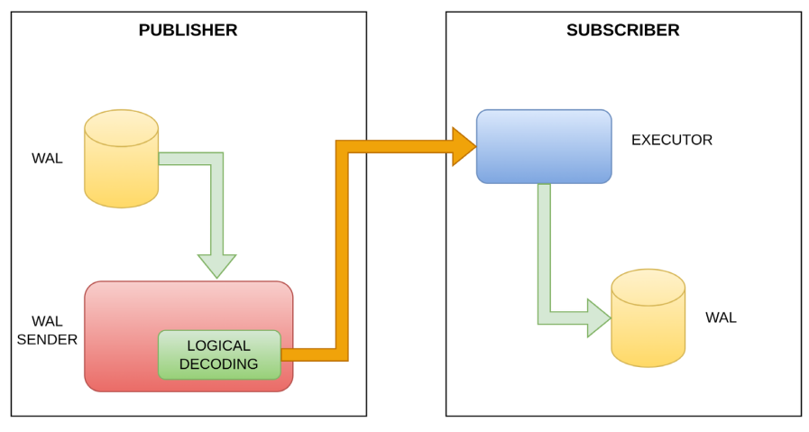

# Logical Replication

> Logical replication is a method that we use to replicate data based on the concept of identity replication.

> REPLICA IDENTITY is a parameter present in table management commands (such as CREATE TABLE and ALTER TABLE); this parameter is used by PostgreSQL to obtain additional information within WAL segments, to recognize which tuples have been eliminated and which tuples have been updated.
>

The `REPLICA IDENTITY` parameter can take four values -

- DEFAULT
- USING INDEX **index_name**
- FULL
- NOTHING

In logical replication, we will take the commands to be sent to the replica server within the WAL segments.
These WAL segments, after being processed through a logical decoding process that reverses the physical information in a logical information, are made available through a publication mechanism.

The primary will then start a publication process, and replica will start a subscription process that, by connecting to the primary's publication, is able to pass the decoded instructions directly to the query executor on the replica machine.



# Logical Replication Servers
```
Publisher -> pg-pub 192.168.100.45
Subscriber -> pg-sub 192.168.200.45

```

# Setup postgresql
```
sudo apt remove postgresql*

sudo apt install curl ca-certificates
sudo install -d /usr/share/postgresql-common/pgdg
sudo curl -o /usr/share/postgresql-common/pgdg/apt.postgresql.org.asc --fail https://www.postgresql.org/media/keys/ACCC4CF8.asc
. /etc/os-release
sudo sh -c "echo 'deb [signed-by=/usr/share/postgresql-common/pgdg/apt.postgresql.org.asc] https://apt.postgresql.org/pub/repos/apt $VERSION_CODENAME-pgdg main' > /etc/apt/sources.list.d/pgdg.list"
sudo apt update

sudo apt -y install postgresql-18
sudo apt -y install postgresql-server-dev-18
sudo apt -y install postgresql-doc-18


# find install postgres packages
sudo dpkg -l | grep postgres
    rc  postgresql-16                        16.9-0ubuntu0.24.04.1                   amd64        The World's Most Advanced Open Source Relational Database
    ii  postgresql-18                        18.0-1.pgdg24.04+3                      amd64        The World's Most Advanced Open Source Relational Database
    ii  postgresql-18-jit                    18.0-1.pgdg24.04+3                      amd64        LLVM JIT support for PostgreSQL 18
    ii  postgresql-client-18                 18.0-1.pgdg24.04+3                      amd64        front-end programs for PostgreSQL 18
    ii  postgresql-client-common             283.pgdg24.04+1                         all          manager for multiple PostgreSQL client versions
    ii  postgresql-common                    283.pgdg24.04+1                         all          PostgreSQL database-cluster manager
    ii  postgresql-doc-18                    18.0-1.pgdg24.04+3                      all          documentation for the PostgreSQL database management system
    ii  postgresql-server-dev-18             18.0-1.pgdg24.04+3                      amd64        development files for PostgreSQL 18 server-side programming

# Get location of initdb or pg_ctl
dpkg -L postgresql-18 | grep -E 'bin/(initdb|pg_ctl)'
    /usr/lib/postgresql/18/bin/initdb
    /usr/lib/postgresql/18/bin/pg_ctl

# Get location of client tool psql
dpkg -L postgresql-client-18 | grep bin/psql
    /usr/lib/postgresql/18/bin/psql

```

## Setup postgres cluster & service
```
# Create cluster
sudo -u postgres /usr/lib/postgresql/18/bin/initdb -D /var/lib/postgresql/18/main

# Start cluster manually
/usr/lib/postgresql/18/bin/pg_ctl -D /var/lib/postgresql/18/main -l logfile start
```

## Create systemd unit for service postgresql@18-main.service
```
sudo nano /etc/systemd/system/postgresql@18-main.service
sudo systemctl daemon-reload
sudo systemctl enable postgresql@18-main
sudo systemctl start postgresql@18-main
sudo systemctl status postgresql@18-main
sudo -u postgres psql -c "\conninfo"


[Unit]
Description=PostgreSQL 18 database server for cluster %i
After=network.target

[Service]
Type=forking

# Path to pg_ctl
ExecStart=/usr/lib/postgresql/18/bin/pg_ctl start -D /var/lib/postgresql/18/main -s -l /var/lib/postgresql/18/main/logfile -o "-c config_file=/var/lib/postgresql/18/main/postgresql.conf"
ExecStop=/usr/lib/postgresql/18/bin/pg_ctl stop -D /var/lib/postgresql/18/main -s -m fast
ExecReload=/usr/lib/postgresql/18/bin/pg_ctl reload -D /var/lib/postgresql/18/main -s -c

# Run as postgres user
User=postgres
Group=postgres

# Give time for startup/shutdown
TimeoutSec=300

[Install]
WantedBy=multi-user.target

```

## Verify path for config files
```
postgres=# show config_file ;
                        config_file
        ---------------------------------------------
        /var/lib/postgresql/18/main/postgresql.conf


postgres=# show hba_file ;
                        hba_file
        -----------------------------------------
        /var/lib/postgresql/18/main/pg_hba.conf

```

# Logical Replication Environment Settings

## Create replicator role on both pg-pub and pg-sub
```
create role replicator with login replication encrypted password 'LearnPostgreSQL';
alter role postgres with password 'LearnPostgreSQL';
```

## Create ~/.pgpass file with chmod 0600 for postgres user on both hosts
```
*:*:*:postgres:'LearnPostgreSQL'
*:*:*:replicator:'LearnPostgreSQL'
```

## Modify postgresql.conf & pg_hba.conf on pub and sub

### Create $PGDATA/conf.d/dba.conf
```
# Check if include_dir = 'conf.d' is enabled
sudo tail -n 20 /etc/postgresql/16/main/postgresql.conf

# Create dba.conf
nano /etc/postgresql/16/main/conf.d/dba.conf
```

#### Add following content in dba.conf
```
# useful on publisher side
listen_addresses = '*'
wal_level = logical
max_wal_senders = 10
max_replication_slots = 10

# useful on subscriber side
max_logical_replication_workers = 4
max_worker_processes = 10

```

### Edit $PGDATA/pg_hba.conf
```
# Edit dba.conf
nano /etc/postgresql/16/main/pg_hba.conf
```

#### Add following content in pg_hba.conf
```
# IPv4 local connections
host all replication 192.168.0.0/16 scram-sha-256
host all all 192.168.0.0/16 scram-sha-256

```

## Restart postgresql service
```
sudo systemctl restart postgresql@18-main.service
```

### Verify if postgres is listening on port 5432
```
netstat -an | grep 5432
sudo ss -tulnp | grep 5432
sudo lsof -i :5432
nc -zv localhost 5432
```

# DDL for Logical Replication Setup

## DDLs On Publisher
```
# create db
create database db_source;

# connect to db
\c db_source

# create table
create table t1 (id integer not null primary key, name varchar(64));

create table table_1(id int primary key, name varchar);
insert into table_1 values (generate_series(1,10), 'data'||generate_series(1,10));

# grant access to replication role
grant usage on schema public to replication;
grant select on public.users to replication;

grant select on all tables in schema public to replication;

# create publication for existing tables
create publication all_tables_pub for all tables;
```

## Transfer schema only to subscriber using pg_dump
```
postgres@pg-sub:~$ pg_dump -h pg-pub -t table_1 -d pub -s | psql -d sub
        SET
        SET
        SET
        SET
        SET
        SET
        set_config 
        ------------
        
        (1 row)

        SET
        SET
        SET
        SET
        SET
        SET
        CREATE TABLE
        ALTER TABLE
        ALTER TABLE
```

## DDLs On Subscriber

```
# create db
create database db_destination;

# connect to db
\c db_destination

# re-create table similar to publisher
create table t1 (id integer not null primary key, name varchar(64));

# create subscription. No password inline. Password to be picket from ~/.pgpass under postgres system user.
sub=# create subscription sub_all_tables connection 'host=pg-pub dbname=pub user=replicator' publication all_tables_pub;
        NOTICE:  created replication slot "sub_all_tables" on publisher
        CREATE SUBSCRIPTION

\d
select * from table_1;

```

# Testing with Data

## Write data on Publisher
```
\c db_source

insert into t1 values (1, 'Linux'), (2, 'FreeBSD');

pub=# insert into table_1 values (generate_series(11,20), 'data'||generate_series(11,20));

update table_1 set name = '1' where id = 1;
```

## Read data on Subscriber
```
\c db_destination

select * from t1;
```