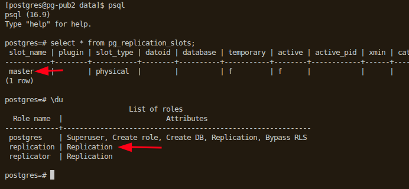

# Steaming Replication on Redhat

```
primary -> pg-pub2 (192.168.100.46)
secondary -> pg-sub2 (192.168.200.46)
```

# Replica Monitoring. Execute on primary
```
select * from pg_stat_replication;
```

# [Setup PostgreSQL Server](https://www.postgresql.org/download/linux/redhat/)
```
sudo dnf install -y https://download.postgresql.org/pub/repos/yum/reporpms/EL-9-x86_64/pgdg-redhat-repo-latest.noarch.rpm
sudo dnf -qy module disable postgresql
sudo dnf install -y postgresql17-server
sudo /usr/pgsql-17/bin/postgresql-17-setup initdb
sudo systemctl enable postgresql-17
sudo systemctl start postgresql-17

sudo systemctl status postgresql-17
```

# Setup Asynchronous replication environment

## On primary, Set `listen_addresses = '*'` in postgresql.conf

## On primary, Create role for replication
```
create role replicator with login replication encrypted password 'LearnPostgreSQL';
```

## On primary, add pg_hba.conf entry for replication
```
host    replication     all     192.168.0.0/16     scram-sha-256
host    replication     all     192.168.0.0/16     scram-sha-256
```

## On primary, reload configuration
```
sudo systemctl reload postgresql-16.service
or
select pg_reload_conf();
```

## On both primary & secondary, create .pgpass file for postgres user
```
sudo su - postgres
vim ~/.pgpass
   *:*:*:postgres:'LearnPostgreSQL'
   *:*:*:replicator:'LearnPostgreSQL'
```

## On secondary, remove PGDATA directory, and recreate emptry PGDATA directory with proper permissions
```
sudo systemctl stop postgresql*

# make sure $pgdata directory is empty with correct permissions
rm -rf /var/lib/pgsql/17/data/*

sudo chown postgres:postgres data
sudo chmod 0700 data
```

## On primary, set an appropriate value for `wal_keep_segments` in postgresql.conf
```
wal_keep_segments = 500
 -- size = 16 mb * 500 = 8000 mb
```

## On primary, create a slot for replication
```
-- get existing slots
select * from pg_replication_slots;

-- to create slot
select * from pg_create_physical_replication_slot('master');
    or
    -- create slot one per replica
    select * from pg_create_physical_replication_slot('pg-sub2');

-- rollback. to drop slot
select pg_drop_replication_slot('master');
```

## On secondary (pg-sub2), as postgres system user, perform pg_basebackup for primary (pg-pub2)

```
sudo su - postgres
cd /var/lib/pgsql/17/data/

# perform physical backup
pg_basebackup -h pg-pub2 -p5432 -U replicator -D /var/lib/pgsql/17/data -Fp -Xs -P -R -S master -C

or

pg_basebackup -h pg-pub2 -p5432 -U replicator --checkpoint=fast \
-D /var/lib/pgsql/17/data -R --slot=master -C

```

### On secondary, check `postgresql.auto.conf` file content

```
[postgres@pg-sub2 data]$ cat postgresql.auto.conf

# Do not edit this file manually!
# It will be overwritten by the ALTER SYSTEM command.
shared_preload_libraries = 'pg_stat_statements, auto_explain, pg_cron, pg_stat_monitor, pglogical, pgaudit'
primary_conninfo = 'user=replication passfile=''/var/lib/pgsql/.pgpass'' channel_binding=prefer host=''pg-pub2'' port=5432 sslmode=prefer sslcompression=0 sslcertmode=allow sslsni=1 ssl_min_protocol_version=TLSv1.2 gssencmode=prefer krbsrvname=postgres gssdelegation=0 target_session_attrs=any load_balance_hosts=disable'
primary_slot_name = 'master'

```

### pg_basebackup command explanation

| Option                     | Description                                                                                   |
|----------------------------|-----------------------------------------------------------------------------------------------|
| `-h pg-pub2`               | Hostname or IP address of the primary server                                                  |
| `-p 5432`                  | Port on which the primary PostgreSQL server is listening                                      |
| `-U replication`           | PostgreSQL user with `REPLICATION` privilege used to take the backup                         |
| `-D /var/lib/pgsql/17/data`| Destination directory for base backup (must be empty or non-existent)                        |
| `-Fp`                      | Output format: plain (copies full directory structure of the data directory)                 |
| `-Xs`                      | Include WAL (Write-Ahead Log) files using **streaming** method during backup. This opens a second connection to the primary server and starts the transfer of the WAL segments at the same time as the backup is performed.                 |
| `-P`                       | Show progress of the backup operation                                                        |
| `-R`                       | Create `standby.signal` and `primary_conninfo` in postgresql.auto.conf for standby setup     |
| `-S master`                | Use replication slot named `master` (created if doesn't exist on primary)                    |
| `-C`                       | Create replication slot if not exists                                                         |


## On secondary, start the PostgreSQL service now
```
[saanvi@pg-sub2 16]$ sudo systemctl start postgresql-16.service
[saanvi@pg-sub2 16]$ sudo systemctl status postgresql-16.service

● postgresql-16.service - PostgreSQL 16 database server
     Loaded: loaded (/usr/lib/systemd/system/postgresql-16.service; enabled; preset: disabled)
     Active: active (running) since Thu 2025-08-07 13:19:24 IST; 5s ago
       Docs: https://www.postgresql.org/docs/16/static/
    Process: 134469 ExecStartPre=/usr/pgsql-16/bin/postgresql-16-check-db-dir ${PGDATA} (code=exited, status=0/SUCCESS)
   Main PID: 134474 (postgres)
      Tasks: 6 (limit: 48880)
     Memory: 293.0M
        CPU: 334ms
     CGroup: /system.slice/postgresql-16.service
             ├─134474 /usr/pgsql-16/bin/postgres -D /var/lib/pgsql/17/data/
             ├─134475 "postgres: logger "
             ├─134476 "postgres: checkpointer "
             ├─134477 "postgres: background writer "
             ├─134478 "postgres: startup recovering 000000010000000000000005"
             └─134479 "postgres: walreceiver streaming 0/5000148"

Aug 07 13:19:24 pg-sub2 systemd[1]: Starting PostgreSQL 16 database server...
Aug 07 13:19:24 pg-sub2 postgres[134474]: 2025-08-07 13:19:24.563 IST [134474] LOG:  pgaudit extension initialized
Aug 07 13:19:24 pg-sub2 postgres[134474]: 2025-08-07 13:19:24.821 IST [134474] LOG:  redirecting log output to logging collector process
Aug 07 13:19:24 pg-sub2 postgres[134474]: 2025-08-07 13:19:24.821 IST [134474] HINT:  Future log output will appear in directory "log".
Aug 07 13:19:24 pg-sub2 systemd[1]: Started PostgreSQL 16 database server.
```

### Validate by psql connection
```
(base) ----- [2025-Aug-07 13:21:02] saanvi@ryzen9 (Linux-Learning)
|------------$ psql -h pg-sub2 -U postgres
psql (17.5 (Ubuntu 17.5-1.pgdg24.04+1), server 16.9)
Type "help" for help.

postgres=# 
postgres=# select pg_is_in_recovery();
 pg_is_in_recovery 
-------------------
 t
(1 row)

postgres=# 
```

### Validate postgresql logs
```
[postgres@pg-sub2 data]$ 
[postgres@pg-sub2 data]$ tail -5 log/postgresql-Thu.log 

2025-08-07 13:19:24.899 IST [134474] LOG:  database system is ready to accept read-only connections
2025-08-07 13:19:24.993 IST [134479] LOG:  started streaming WAL from primary at 0/5000000 on timeline 1
2025-08-07 13:24:24.840 IST [134476] LOG:  restartpoint starting: time
2025-08-07 13:24:24.845 IST [134476] LOG:  restartpoint complete: wrote 1 buffers (0.0%); 0 WAL file(s) added, 0 removed, 1 recycled; write=0.001 s, sync=0.001 s, total=0.005 s; sync files=0, longest=0.000 s, average=0.000 s; distance=16384 kB, estimate=16384 kB; lsn=0/5000098, redo lsn=0/5000060
2025-08-07 13:24:24.845 IST [134476] LOG:  recovery restart point at 0/5000060
[postgres@pg-sub2 data]$ 
[postgres@pg-sub2 data]$ 
```

### On secondary, Try creating a table
```
postgres=# 
postgres=# create table test_on_secondary (id integer);
ERROR:  cannot execute CREATE TABLE in a read-only transaction
postgres=# 
postgres=# 
```

### On primary, Try creating a table
```
postgres=# \c dba
psql (17.5 (Ubuntu 17.5-1.pgdg24.04+1), server 16.9)
You are now connected to database "dba" as user "postgres".
dba=# 
dba=# create table test_on_primary (id integer);
CREATE TABLE
dba=# 
```

### On primary, while in Asynchronous Replication
```
select * from pg_stat_replication;
   -[ RECORD 1 ]----+---------------------------------
   pid              | 2251
   usesysid         | 16388
   usename          | replicator
   application_name | walreceiver
   client_addr      | 192.168.200.46
   client_hostname  | 
   client_port      | 53380
   backend_start    | 2025-09-25 17:36:08.376112+05:30
   backend_xmin     | 
   state            | streaming
   sent_lsn         | 0/3000168
   write_lsn        | 0/3000168
   flush_lsn        | 0/3000168
   replay_lsn       | 0/3000168
   write_lag        | 
   flush_lag        | 
   replay_lag       | 
   sync_priority    | 0
   sync_state       | async
   reply_time       | 2025-09-25 17:46:48.594332+05:30

postgres=# SHOW synchronous_standby_names;
   -[ RECORD 1 ]-------------+-
   synchronous_standby_names | 
```

# On replica, while in Asynchronous Replication
```

postgres=# show primary_slot_name ;
   -[ RECORD 1 ]-----+-------
   primary_slot_name | master


postgres=# show primary_conninfo ;
   -[ RECORD 1 ]----+--------------------------------------------------------------------------------------------------------------------------------------------------------------------------------------------------------------------------------------------------------------------------------------------------------------------------------
   primary_conninfo | user=replicator passfile='/var/lib/pgsql/.pgpass' channel_binding=prefer host='pg-pub2' port=5432 sslmode=prefer sslnegotiation=postgres sslcompression=0 sslcertmode=allow sslsni=1 ssl_min_protocol_version=TLSv1.2 gssencmode=prefer krbsrvname=postgres gssdelegation=0 target_session_attrs=any load_balance_hosts=disable

postgres=# SELECT * FROM pg_stat_wal_receiver;
   -[ RECORD 1 ]---------+-------------------------------------------------------------------------------------------------------------------------------------------------------------------------------------------------------------------------------------------------------------------------------------------------------------------------------------------------------------------------------------
   pid                   | 2342
   status                | streaming
   receive_start_lsn     | 0/3000000
   receive_start_tli     | 1
   written_lsn           | 0/3000168
   flushed_lsn           | 0/3000168
   received_tli          | 1
   last_msg_send_time    | 2025-09-25 17:48:38.623807+05:30
   last_msg_receipt_time | 2025-09-25 17:48:38.624083+05:30
   latest_end_lsn        | 0/3000168
   latest_end_time       | 2025-09-25 17:36:08.384265+05:30
   slot_name             | master
   sender_host           | pg-pub2
   sender_port           | 5432
   conninfo              | user=replicator passfile=/var/lib/pgsql/.pgpass channel_binding=prefer dbname=replication host=pg-pub2 port=5432 fallback_application_name=walreceiver sslmode=prefer sslnegotiation=postgres sslcompression=0 sslcertmode=allow sslsni=1 ssl_min_protocol_version=TLSv1.2 gssencmode=prefer krbsrvname=postgres gssdelegation=0 target_session_attrs=any load_balance_hosts=disable

```

# Synchronous Replication

## On primary, update `postgresql.conf` settings
```
synchronous_commit = on

synchronous_standby_names = 'pgsub2'
or
synchronous_standby_names = '*'
```

### Restart primary postgresql service
```
sudo systemctl restart postgresql-16.service
```

## On secondary, update `postgresql.auto.conf` file. Append `application_name=<secondary_replica_name>` at the end of `primary_conninfo` setting.
```
# **** Before update
[saanvi@pg-sub2 16]$ sudo cat /var/lib/pgsql/17/data/postgresql.auto.conf
# Do not edit this file manually!
# It will be overwritten by the ALTER SYSTEM command.
shared_preload_libraries = 'pg_stat_statements, auto_explain, pg_cron, pg_stat_monitor, pglogical, pgaudit'
primary_conninfo = 'user=replication passfile=''/var/lib/pgsql/.pgpass'' channel_binding=prefer host=''pg-pub2'' port=5432 sslmode=prefer sslcompression=0 sslcertmode=allow sslsni=1 ssl_min_protocol_version=TLSv1.2 gssencmode=prefer krbsrvname=postgres gssdelegation=0 target_session_attrs=any load_balance_hosts=disable'
primary_slot_name = 'master'

# **** After Update
[saanvi@pg-sub2 16]$ sudo cat /var/lib/pgsql/17/data/postgresql.auto.conf
# Do not edit this file manually!
# It will be overwritten by the ALTER SYSTEM command.
shared_preload_libraries = 'pg_stat_statements, auto_explain, pg_cron, pg_stat_monitor, pglogical, pgaudit'
primary_conninfo = 'user=replication passfile=''/var/lib/pgsql/.pgpass'' channel_binding=prefer host=''pg-pub2'' port=5432 sslmode=prefer sslcompression=0 sslcertmode=allow sslsni=1 ssl_min_protocol_version=TLSv1.2 gssencmode=prefer krbsrvname=postgres gssdelegation=0 target_session_attrs=any load_balance_hosts=disable application_name=pgsub2'
primary_slot_name = 'master'
```

### Restart secondary postgresql service
```
sudo systemctl restart postgresql-16.service
```

### On primary, Verify change by querying
```
select * from pg_stat_replication;


postgres=# select * from pg_stat_replication;
   -[ RECORD 1 ]----+---------------------------------
   pid              | 3031
   usesysid         | 16388
   usename          | replicator
   application_name | pgsub2
   client_addr      | 192.168.200.46
   client_hostname  | 
   client_port      | 35010
   backend_start    | 2025-09-25 19:07:47.038421+05:30
   backend_xmin     | 
   state            | streaming
   sent_lsn         | 0/30003D0
   write_lsn        | 0/30003D0
   flush_lsn        | 0/30003D0
   replay_lsn       | 0/30003D0
   write_lag        | 
   flush_lag        | 
   replay_lag       | 
   sync_priority    | 1
   sync_state       | sync
   reply_time       | 2025-09-25 19:08:17.054887+05:30
```

### On secondary, verify 
```
postgres=# select * from pg_stat_wal_receiver ;
   -[ RECORD 1 ]---------+-------------------------------------------------------------------------------------------------------------------------------------------------------------------------------------------------------------------------------------------------------------------------------------------------------------------------------------------------------------------------------------------------------------
   pid                   | 3241
   status                | streaming
   receive_start_lsn     | 0/3000000
   receive_start_tli     | 1
   written_lsn           | 0/30003D0
   flushed_lsn           | 0/3000000
   received_tli          | 1
   last_msg_send_time    | 2025-09-25 19:08:47.05997+05:30
   last_msg_receipt_time | 2025-09-25 19:08:47.060153+05:30
   latest_end_lsn        | 0/30003D0
   latest_end_time       | 2025-09-25 19:07:47.043996+05:30
   slot_name             | master
   sender_host           | pg-pub2
   sender_port           | 5432
   conninfo              | user=replicator passfile=/var/lib/pgsql/.pgpass channel_binding=prefer dbname=replication host=pg-pub2 port=5432 application_name=pgsub2 fallback_application_name=walreceiver sslmode=prefer sslnegotiation=postgres sslcompression=0 sslcertmode=allow sslsni=1 ssl_min_protocol_version=TLSv1.2 gssencmode=prefer krbsrvname=postgres gssdelegation=0 target_session_attrs=any load_balance_hosts=disable

```


# Cleanup
```
# remove everything related to postgres
sudo dnf remove postgres*


```