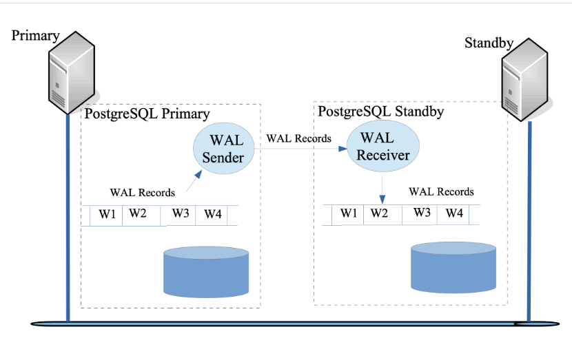

# PostgreSQL Replication: Physical Steaming Replication

primary -> pg-pub (192.168.100.45)
secondary -> pg-sub (192.168.200.45)

## Physical streaming replication
Streaming replication is the process of sending WAL records as and when they are generated to another PostgreSQL server for the purpose of creating a standby server by replaying WAL records. The standby server is configured to be in recovery mode. The sole purpose of this server is to apply any new WAL records when they arrive. This second server then becomes a warm backup of the primary server. The standby can also be configured to be a read replica, where it can also serve read-only queries. This is called a hot standby.

In streaming replication the standby server connects to the primary server and receives WAL records using a replication protocol. This provides two advantages when compared to log shipping:

The standby server does not need to wait for the WAL file to fill up, hence the replication lag is improved.
The dependency on the user-provided script and an intermediate shared storage between the servers is removed.




## WAL sender and WAL receiver
A process known as the WAL receiver, running on the standby server connects—using the connection details provided in the primary_conninfo parameter of postgresql.conf—to the primary server using a TCP/IP connection. In the primary server, another process, called the WAL sender, is in charge of sending the WAL records to the standby server as and when they are generated.

The WAL receiver saves the WAL records in the WAL as though they were generated by the client activity of locally connected clients. Once the WAL records reach the WAL segment files, the standby server constantly keeps replaying the WAL so that standby and primary are up to date.

## Configuration Steps

*Step 1*: switch to postgres user
```
su - postgres
```

*Step 2*: Modify postgresql.conf for the primary server.
```
cat >> /tmp/data_primary/postgresql.conf <<EOF

synchronous_standby_names = '*'
port = 6432

logging_collector = on
log_connections = on
log_disconnections = on
log_statement = 'all'
log_replication_commands = on

EOF
```

*Step 3*: Start the primary server on port 6432.
```
/usr/lib/postgresql/12/bin/pg_ctl -D /tmp/data_primary start
```

*Step 4*: Create a replication slot named node_a_slot on the primary server.
```
/usr/lib/postgresql/12/bin/psql --port=6432 --host=localhost --username=postgres --dbname=postgres --command="SELECT * FROM pg_create_physical_replication_slot('node_a_slot')"
```

*Step 5*: Take the base backup to bootstrap the standby server.
```
/usr/lib/postgresql/12/bin/pg_basebackup --pgdata=/tmp/data_standby/ --format=p --write-recovery-conf --checkpoint=fast --label=mffb --host=localhost --port=6432 --username=postgres

```

*Step 6*: Launch the CLI tool psql for the primary server.
```
/usr/lib/postgresql/12/bin/psql --port=6432 --host=localhost --username=postgres --dbname=postgres
```

*Step 7*: Launch a second terminal.
```
whoami
```

*Step 8*: Log in as postgres user.
```
su - postgres
```

*Step 9*: Modify postgresql.conf for the standby server.
```
cat >> /tmp/data_standby/postgresql.conf <<EOF

port = 7432
primary_slot_name = 'node_a_slot'
hot_standby = on

logging_collector = on
log_connections = on
log_disconnections = on
log_statement = 'all'
log_replication_commands = on

synchronous_standby_names = ''

EOF
```

*Step 10*: Start the standby server on port 7432.
```
/usr/lib/postgresql/12/bin/pg_ctl -D /tmp/data_standby start
```

*Step 11*: Launch the CLI tool psql for the standby server.
```
/usr/lib/postgresql/12/bin/psql --port=7432 --host=localhost --username=postgres --dbname=postgres
```

*Step 12*: Create a table on the primary.
```
CREATE TABLE numbers(a int, b varchar(250));
```

*Step 13*: Insert a row in the newly created table.
```
INSERT INTO numbers VALUES(1,'One');
```

*Step 14*: Check the replicated table and rows on the standby server.
```
SELECT * FROM numbers;
```

*Step 15*: Try inserting a row in the replicated table on the standby. It will report an error.
```
INSERT INTO numbers VALUES(2,'Two');
```

## Failover
Following are the steps for failover:

*Step 1*: Launch a third terminal.
```
whoami
```

*Step 2*: Log in as postgres user.
```
su - postgres
```

*Step 3*: Stop the primary server.
```
/usr/lib/postgresql/12/bin/pg_ctl -D /tmp/data_primary stop -m immediate
```

*Step 4*: Promote the standby server as the new primary.
```
/usr/lib/postgresql/12/bin/pg_ctl -D /tmp/data_standby promote
```

*Step 5*: Connect to the promoted standby.
```
/usr/lib/postgresql/12/bin/psql --port=7432 --host=localhost --username=postgres --dbname=postgres
```

*Step 6*: Insert a row in the replicated table. The fact that insert is successful means that standby has been promoted.
```
INSERT INTO numbers VALUES(2,'Two');
```
